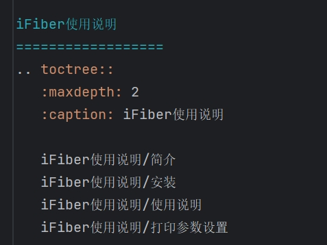
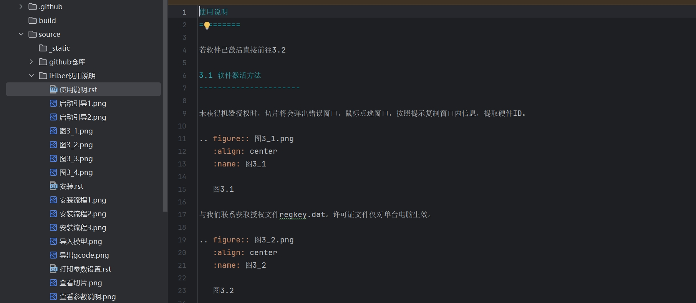

# Fiber210 文档

访问文档网址：[https://fiber210.github.io/docs/](https://fiber210.github.io/docs/)

## 使用方法

添加内容后在main分支push自动更新gh_docs分支和网站。

### 添加内容步骤

1. 创建GitHub新的分支。

2. 修改 `source` 目录下的 `index.rst` 文件，添加新 `.rst` 文件的引用。如下图

    

3. 在上路写的路径下创建新的 `.rst` 文件来添加内容。

    

4. 修改后运行 make html 可以生成网页页面，运行make clean 可以清空，运行 make html 点开 build/html/index,html 查看修改后的内容。

5. 若修改后内容无误，先运行 make clean，将修改的内容上传并合并到main分支。 