.. figure:: image/image1.png
   :align: center
   :width: 10em

148拉伸机使用说明
==================

**撰写：** 王实
**审核：** 陆殿雄
**特别感谢：** 傅前亮

----

.. contents:: 目录
   :depth: 2
   :local:

----

一、设备概述
------------

本设备为 **济事楼 148** 的单臂材料试验机，配套 iDearTest 测试软件。设备支持两种试验模式：

.. list-table::
   :header-rows: 1

   * - 试验类型
     - 标准
     - 工具头
   * - 层间剪切（三点弯曲）
     - ASTM_D2344
     - 加载头 + 支撑座
   * - 丝材拉伸
     - ASTM_D4018
     - 上下钳型夹持头

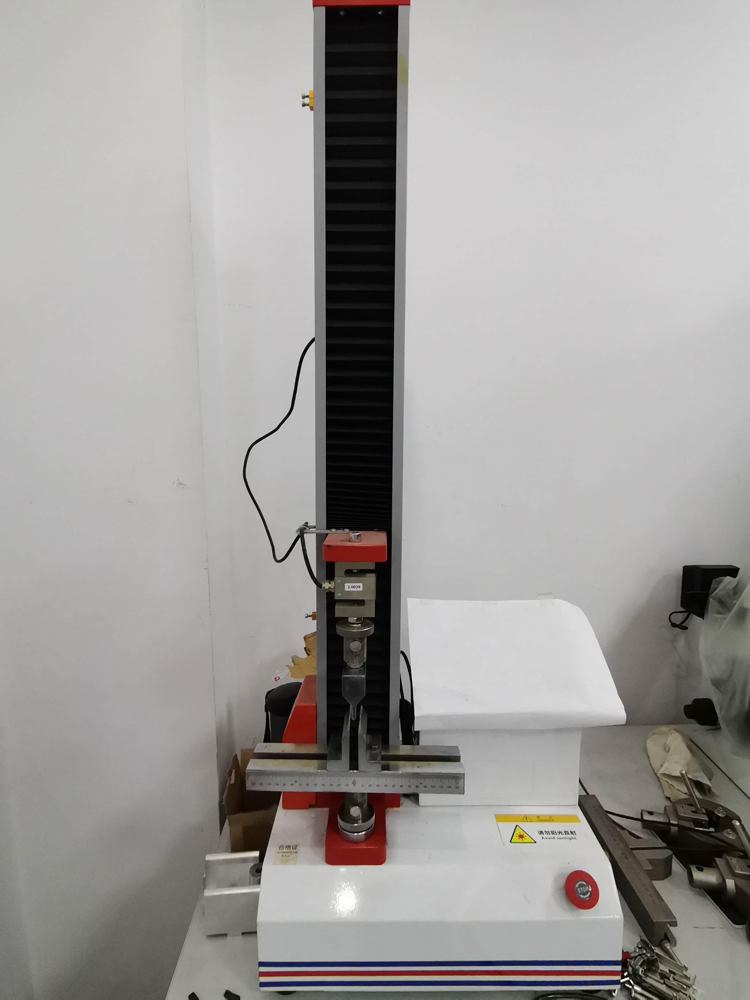

   单臂材料试验机

----

二、设备操作流程
----------------

2.1 工具头与夹具
~~~~~~~~~~~~~~~~~

设备配有多套工具头，使用前需确认安装正确：

**三点弯曲工具头**\ （层间剪切试验用）：

- 上部：加载头
- 下部：带标尺的支撑座
- 此套工具较新，注意与形状相似但压头圆角半径不同的旧工具区分

   三点弯曲工具头

**拉伸夹持工具头**\ （丝材拉伸试验用）：

- 上下两端均为带夹持功能的钳型工具
- 通过操作杆控制钳口开合

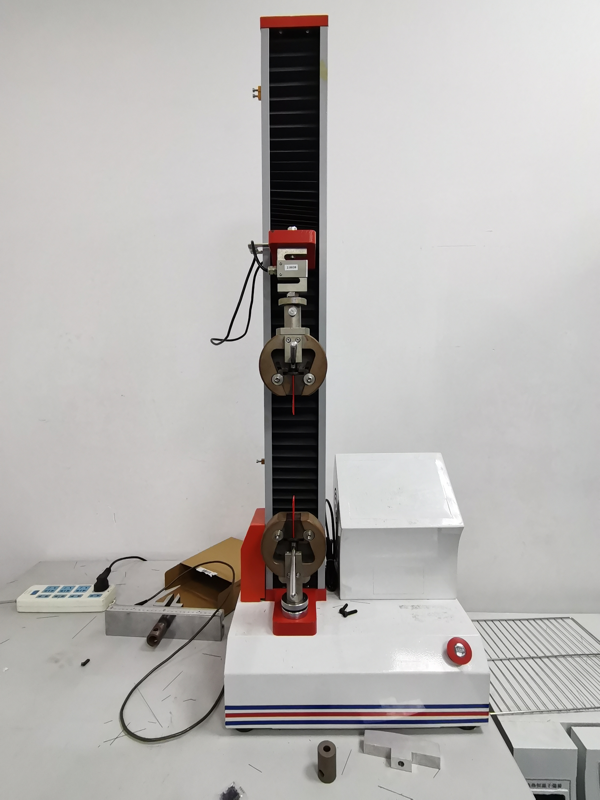

   夹持工具头

2.2 开机与联机
~~~~~~~~~~~~~~~

**第一步：开机与接线**

1. 将引出的连接线插入电脑 USB 口
2. 打开试验机背面的电源开关
3. 在电脑 **设备管理器** 中找到该 USB 端口对应的串口号（例如 COM3）

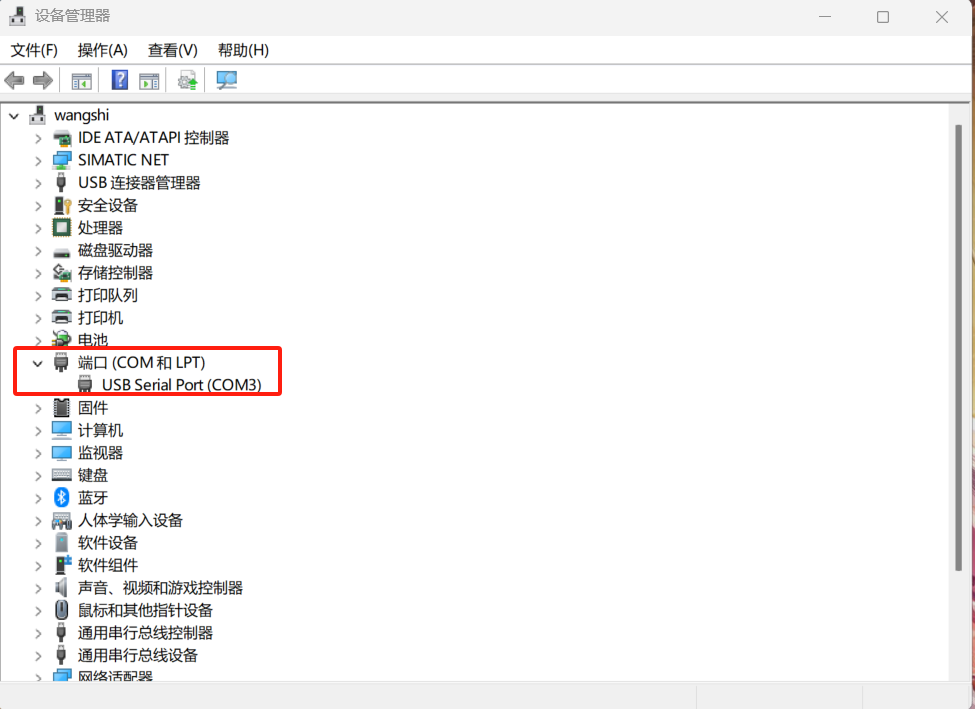

   设备管理器界面

**第二步：登录 iDearTest**

双击 ``iDearTest.exe``，进入登录界面，默认用户名与密码皆为 ``test``。

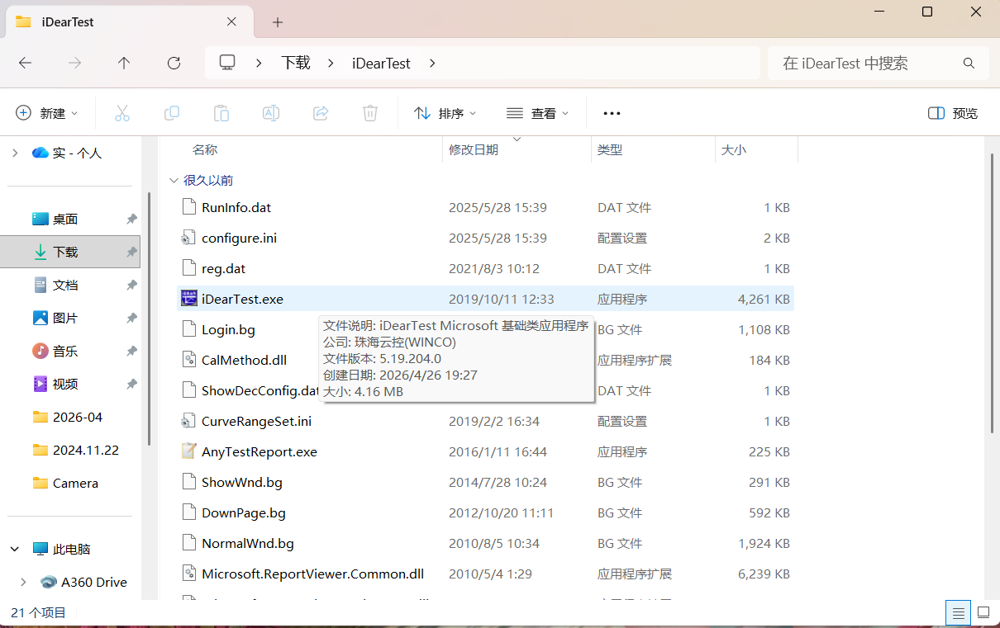

   iDearTest测试软件

   iDearTest登录界面

**第三步：联机**

1. 登录后界面右上角显示"当前状态：脱机"
2. 点击菜单栏 **联机** → 弹出联机设备选择界面
3. 将端口号选为设备管理器中查询到的端口号，点击确定
4. 连接成功后右上角显示"当前状态：\ **待机**\ "，力与位移数值框出现读数

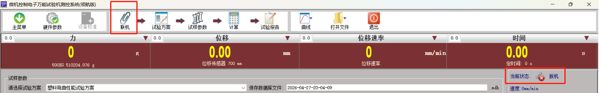

   脱机界面

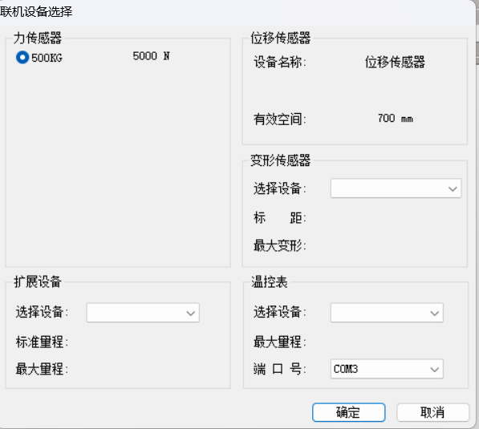

   联机设备选择界面

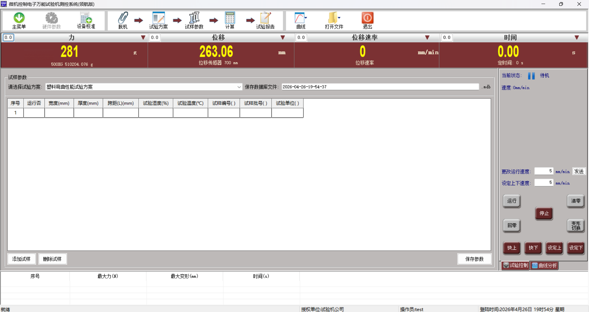

   测试软件主界面

.. note:: **USB 连接故障排除**：该机器 USB 接口可能接触不良。若联机时弹出"请连接到控制板"，尝试以下措施：
   - 多次插拔 USB 线，或换插电脑其他 USB 口
   - 重新打开软件后再点联机
   - 先打开软件再插 USB，或先插 USB 再打开软件
   - 若长时间尝试仍未成功，换一台电脑尝试

2.3 试验方案
~~~~~~~~~~~~~

点击菜单栏 **试验方案** 进行选择或自定义：

.. list-table::
   :header-rows: 1

   * - 试验
     - 方案名称
   * - 层间剪切
     - 塑料弯曲性能试验方案
   * - 丝材拉伸
     - 塑料拉伸性能试验方案

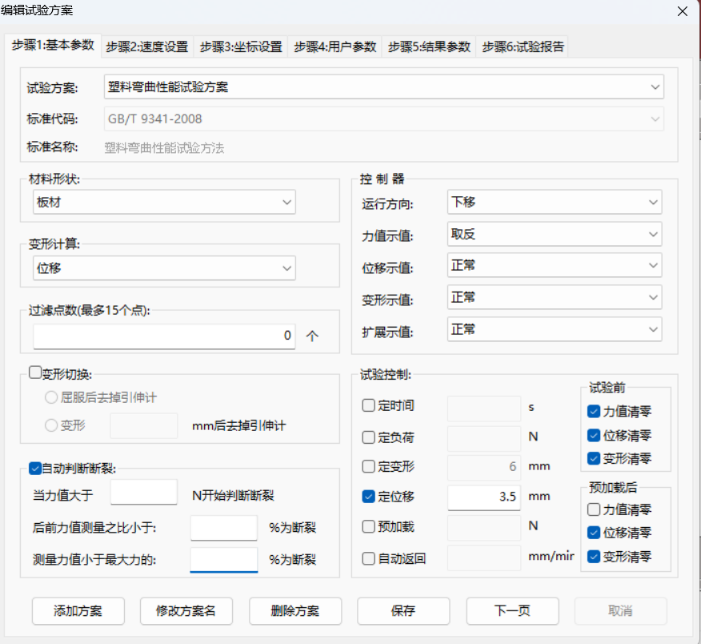

   试验方案选择

自动判断断裂选项如未开启，可根据标准手动设置停止条件（弯曲试验可设置定位移 3.5mm）。该设置非必须，试验中也可手动点击停止。

2.4 开始实验
~~~~~~~~~~~~~

**遥控器操作**：

.. list-table::
   :header-rows: 1

   * - 类型
     - 按钮
     - 行为
     - 注意
   * - **保持型**
     - 上升、下降
     - 按下持续动作，按停止才停
     - 长距离移动谨防过快冲压/拉断试样
   * - **点动型**
     - 慢上、慢下、微上、微下
     - 按下只动作一次，松手即复位
     - 接近试样时用微上/微下精细调整

**操作步骤**：

1. 将试样放置好后，点击力传感器数值框左上角的 **"0.0"** 图标清零
2. 使用遥控器调整加载头位置，接近试样时用微调，至力值出现读数（一般 **小于 1000** 即可，单位为 g）

   清零按钮

3. 点击主界面右下方的 **运行** 按钮，试验机自动加载，软件切换到试验曲线界面

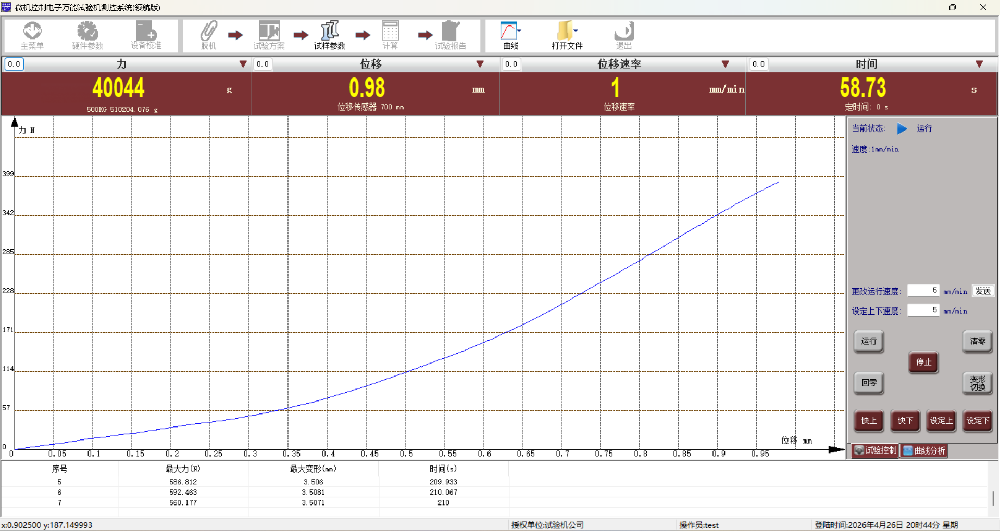

   位移与力曲线

界面下方可直接查看每次试验的 **最大力** 与 **最大变形**。

2.5 数据处理
~~~~~~~~~~~~~

结果文件为 ``.mdb`` 格式，储存在 ``iDearTest\outputfile`` 路径下：

- 每 10 次试验归为一组，储存在一个 mdb 文件中
- 超过 10 次自动存入下一个 mdb 文件
- 每次重新打开软件也会生成新的 mdb 文件

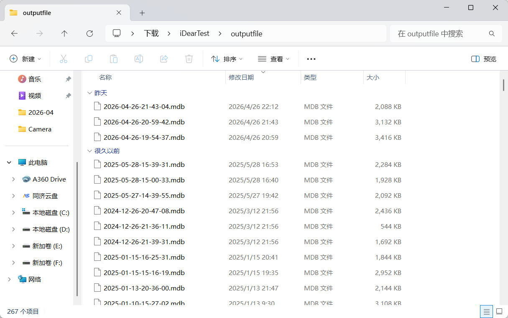

   结果文件

处理步骤：

1. 用 **Access** 软件打开 ``.mdb`` 文件
2. 另存为 ``.xlsx`` 格式的 Excel 文件
3. 用代码绘图并计算强度（参考附录的数据处理程序）

2.6 关机
~~~~~~~~~

1. 关闭 iDearTest 软件
2. 关闭试验机电源
3. 清理桌面，工具归位

----

三、层间剪切试验（三点弯曲）
----------------------------

3.1 试验介绍
~~~~~~~~~~~~~

依据 **ASTM_D2344** 标准，测定高模量纤维增强聚合物基层压板的短梁强度。适用于连续或不连续纤维增强的聚合物基复合材料，材料弹性性能需关于梁纵轴均衡对称。

3.2 试样制备
~~~~~~~~~~~~~

**试样尺寸**：21mm × 7mm × 3.5mm

**加载条件**：跨距与厚度比 = 4，最小厚度 2mm

**制备流程**：

1. 在 iFiber 中导入 105mm × 7mm × 3.5mm 的立方体模型
2. 生成 Gcode，T300 打印机打印
3. 在样条上画标记线，分为 5 段，每段 21mm

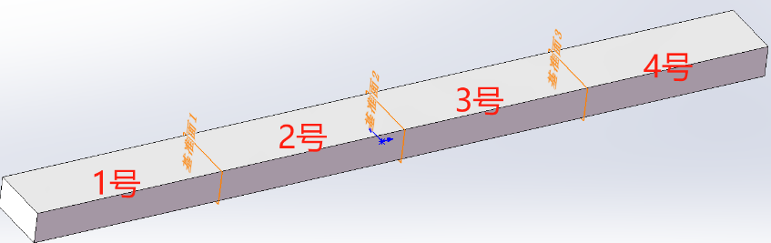

   样条分割示意图

4. 用台钳夹住样条，沿标记线用锯子锯断（保持水平、竖直）

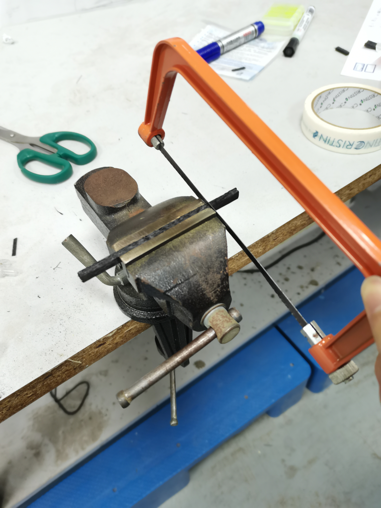

   锯断样条

5. 得 5 个 21mm 小样条，用美纹纸粘贴到 A4 纸上妥善保存
6. 测量每个样条的实际长、宽、高

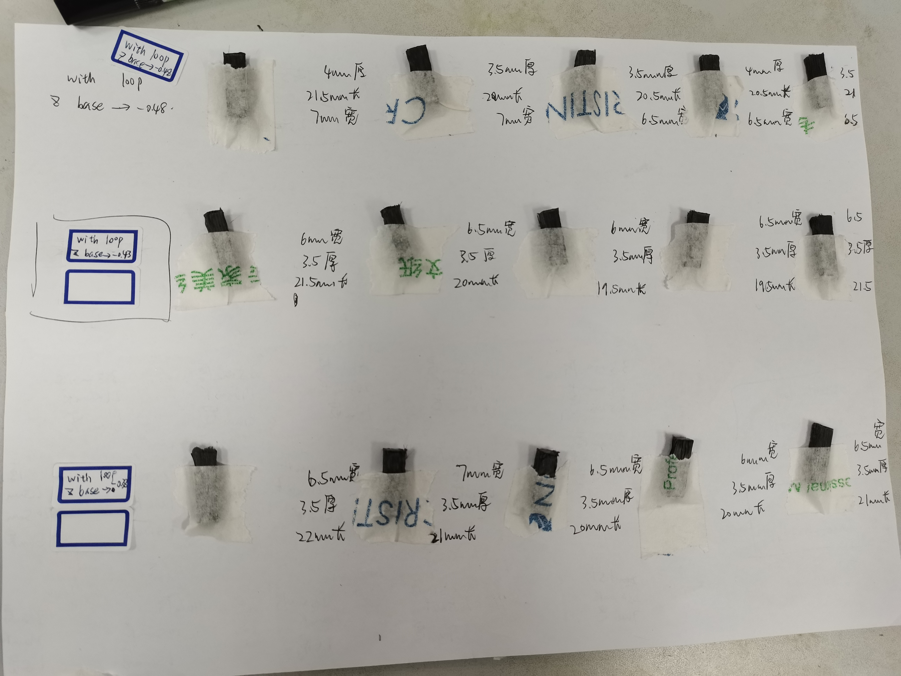

   妥善保存样条并测量其尺寸

.. important:: 若切片填充方式为 line，最后 21mm 为被动段打印（纤维由前面已粘接的纤维拖拽出来），性能上有差异。实际测试中通常只取前 4 段作为平行试验，最后 1 段若无特别需要应分开处理。

每种测试条件至少 **5 个** 样件。

3.3 工具头配置
~~~~~~~~~~~~~~~

安装三点弯曲工具头：

- 上部：加载头
- 下部：带标尺支撑座

调整跨距：

- 两个支撑块跨距 **14mm**
- 确保支撑块顶部圆角的 **圆心** 落在 7mm 刻度线上方（不是侧壁）

3.4 试验步骤
~~~~~~~~~~~~~

按第二章完成开机联机后，选择 **塑料弯曲性能试验方案**\ （方向下移，1mm/min）：

1. 将试样 **水平居中** 放在支撑块上
2. 力值清零
3. 下降加载头至力值 ≤ 1000
4. 点击 **运行**，位移达 3.5mm 时点击停止（或提前手动停止）
5. 一般取第一个波峰的值作为结果
6. 抬起加载头，取出试样

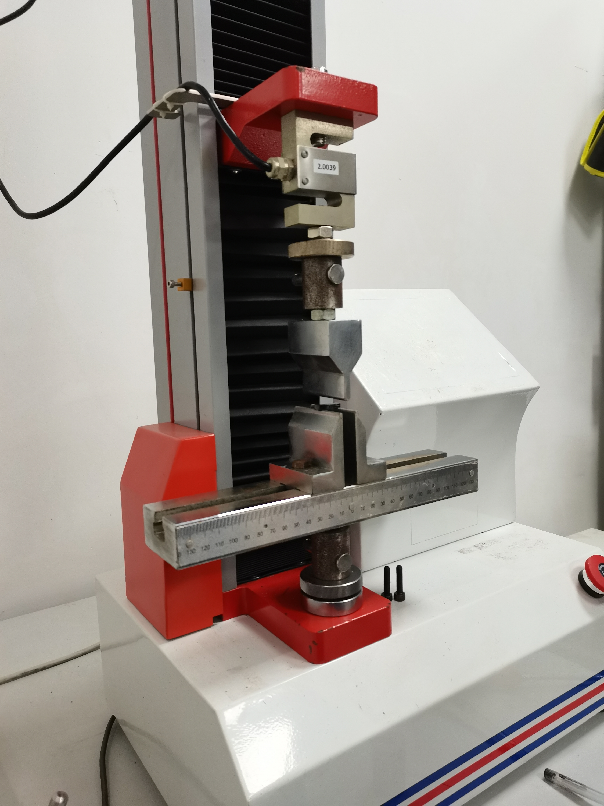

   加载后取出试样

7. 重复以上步骤进行下一试样

----

四、丝材拉伸试验
----------------

4.1 试验介绍
~~~~~~~~~~~~~

依据 **ASTM_D4018** 标准，测定碳纤维原丝的拉伸强度、拉伸模量和断裂伸长率。适用于树脂浸渍固结的连续长丝碳纤维、石墨纤维纱线、粗纱和丝束试样。

4.2 试样制备
~~~~~~~~~~~~~

**有效拉伸段**：150mm（两端各粘接固定 25mm）

**端片（End Tab）尺寸**：70mm × 30mm × 2mm

.. note:: 若济事楼 148 未找到端片，可让同门用拓竹打印机打印。

**制备流程**：

1. 将纤维浸入树脂槽，经辊压/模具使树脂均匀分布
2. 将纤维丝切割为 **200mm** 长的单根试样（用钢尺量取，剪刀剪断）
3. 每种测试条件至少 **4 个** 试样

**粘接步骤**：

1. 在端片上 25mm 处画记号线与中垂线

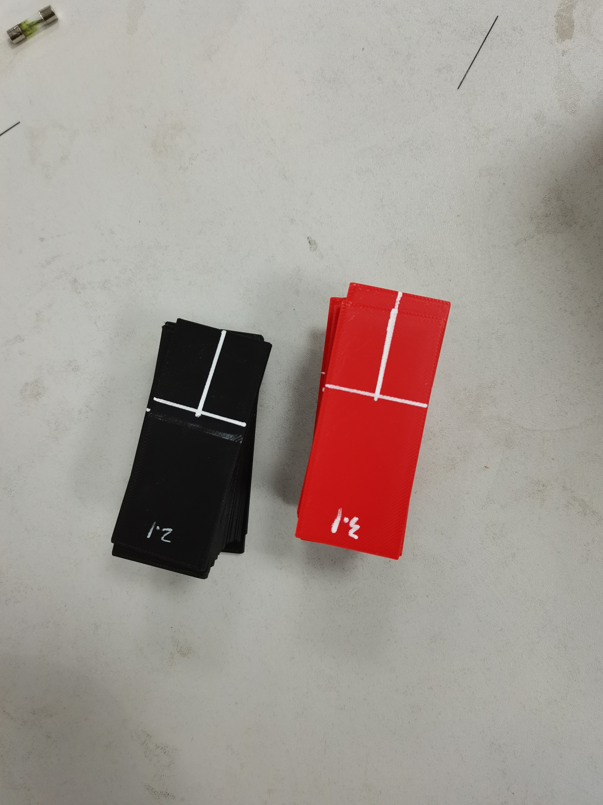

   做好标记的端片

2. 用美纹纸将试样两端初步固定在记号线交点处
3. 在端片上喷底涂（晾晒一分钟）
4. 沿丝材区域涂胶水（不宜过多，盖住丝材即可）
5. 涂抹过程中保持丝材不偏离记号线，纤维维持自然长度不弯折
6. 静置 **24 小时** 使胶水完全凝固

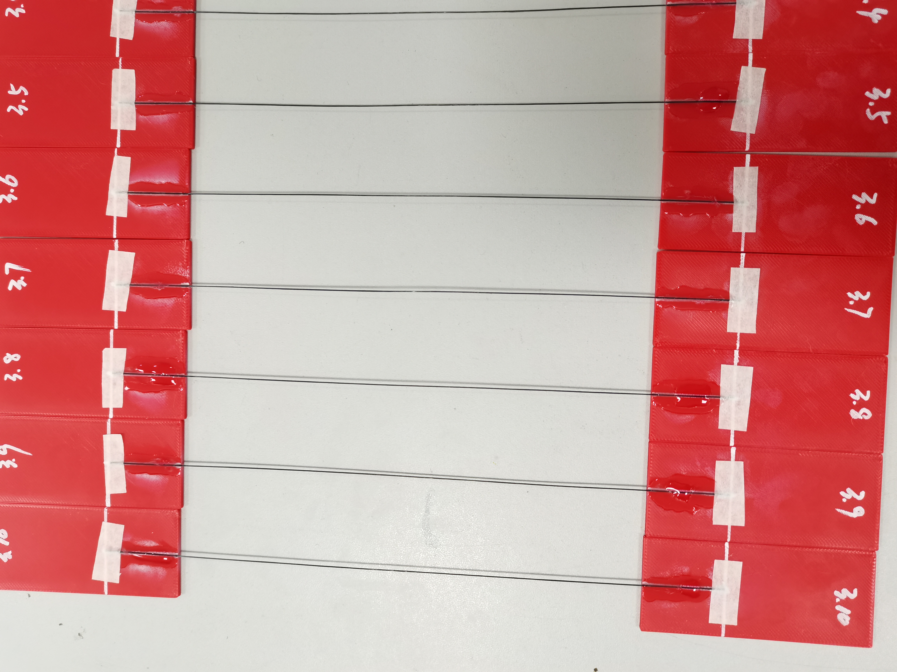

   将试样粘接到端片上

4.3 工具头配置
~~~~~~~~~~~~~~~

安装拉伸夹持工具头：

- 上下两端均为钳型工具
- 通过操作杆控制钳口开合
- 确保夹具对中，两端片在同一竖直线上

4.4 试验步骤
~~~~~~~~~~~~~

按第二章完成开机联机后，选择 **塑料拉伸性能试验方案**\ （方向上移，1mm/min）：

1. 降下工具头，使距离 **略小于** 丝材长度
2. 打开钳口，夹住上下端片后端（记号线后未粘接丝材位置）
3. 确保两端片在同一竖直线上

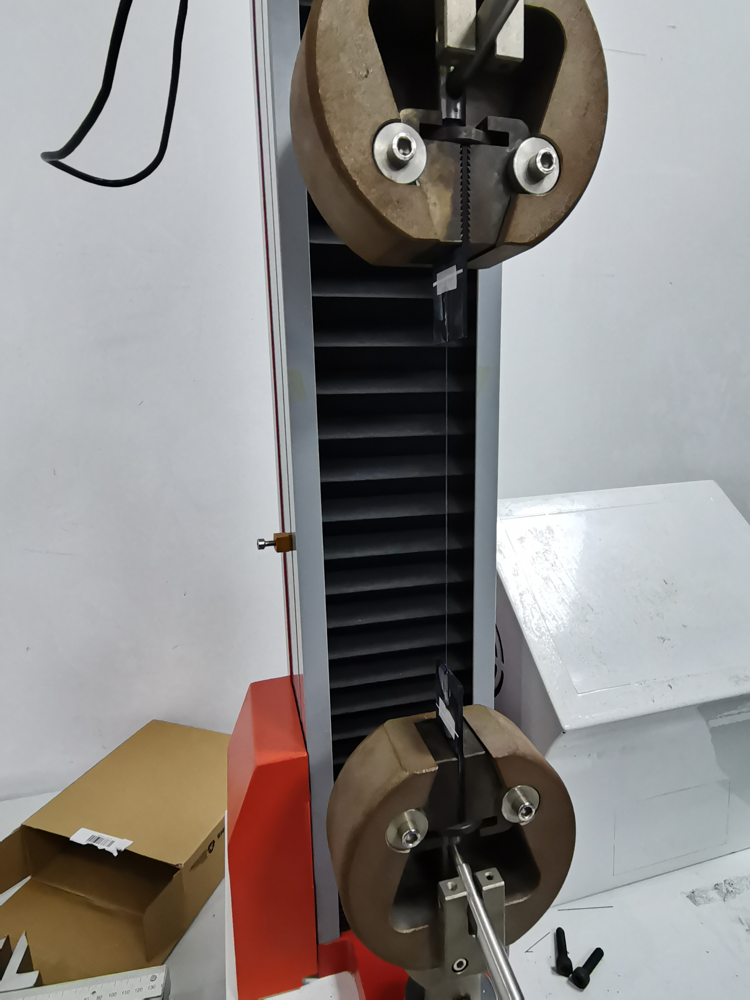

   夹持端片以固定试样

4. 夹持后丝材略有弯曲为正常现象
5. 力值清零
6. 缓慢抬升工具头至丝材近乎绷直，力值 ≤ 1000
7. 点击 **运行**，拉断后试验自动结束
8. 打开钳口取下端片
9. 重复以上步骤进行下一试样

----

附录  数据处理程序
------------------

以上两项力学试验的结果文件都是 ``.mdb`` 格式，用 Access 转换为 ``.xlsx`` 后，可使用以下程序进行绘图并得出最大力值与对应位移。使用时按需修改输入/输出路径和坐标轴范围。

结果示例：

.. code-block:: text

   TestNo: 1, Max Load: 9357.08 N at Position: 3.73 m
   TestNo: 2, Max Load: 4122.18 N at Position: 2.42 m
   TestNo: 3, Max Load: 8469.51 N at Position: 3.73 m
   TestNo: 4, Max Load: 9668.69 N at Position: 3.58 m
   TestNo: 5, Max Load: 4255.90 N at Position: 2.11 m
   TestNo: 6, Max Load: 6661.93 N at Position: 2.83 m

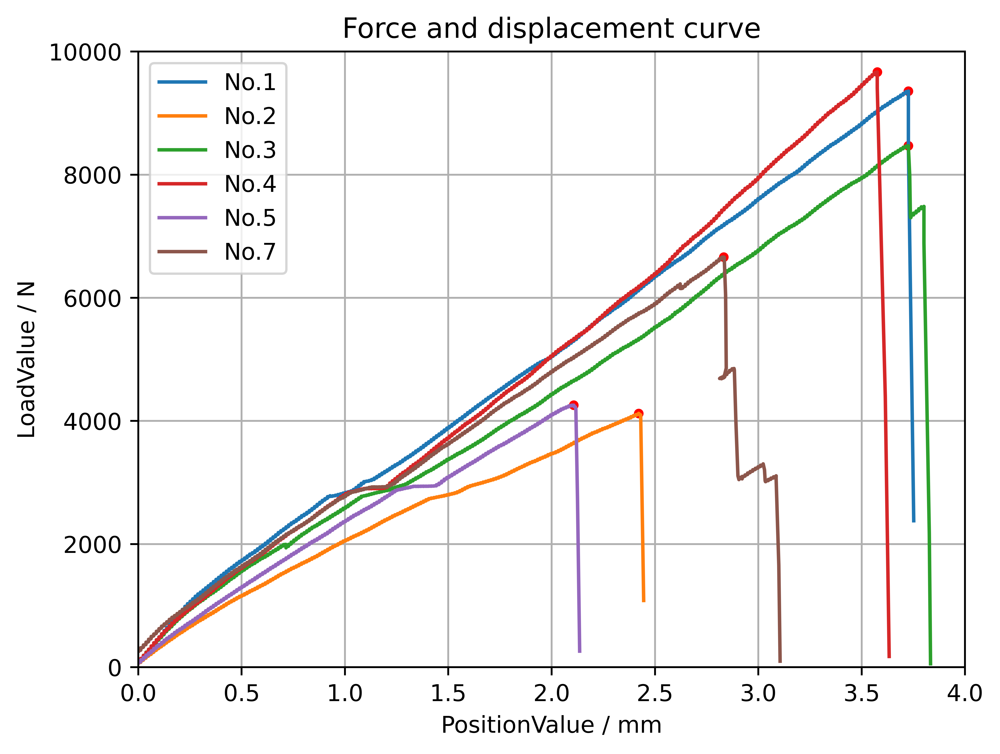

   位移与力的折线图

程序主体（傅前亮提供）：

.. code-block:: python

   import pandas as pd
   import matplotlib.pyplot as plt

   # 读取Excel文件并选择前4列
   path = 'drive/MyDrive/OriginalData1.xlsx'
   df = pd.read_excel(path, sheet_name="OriginalData")
   df = df.iloc[:, 1:5]  # 从数据框中提取第2到第5列

   # 查找 'TestNo' 列的最小值和最大值
   testNoMin = df['TestNo'].min()
   testNoMax = df['TestNo'].max()

   # 根据 'TestNo' 分组数据
   exp_df = df.groupby("TestNo")

   # 设置图表参数
   plt.figure(dpi=1080)  # 设置图像的分辨率
   rate = 1  # 采样率，1 表示使用全部数据

   # 遍历每个分组并绘制数据
   for name, group in exp_df:
       exp_id = int(name)
       if testNoMin <= exp_id <= testNoMax:
           # 绘制折线图，显示全部数据
           plt.plot(
               group['PositionValue'][::rate],  # 使用 PositionValue 列
               group['LoadValue'][::rate],  # 使用 LoadValue 列
               label=f'No.{name-testNoMin+1}'  # 为线条添加标签
           )

           # 找到 LoadValue 最大值的索引
           max_index = group['LoadValue'].idxmax()
           max_position = group['PositionValue'][max_index]  # 对应的最大 PositionValue
           max_load = group['LoadValue'][max_index]  # 最大的 LoadValue 值

           # 在最大值处添加标记
           plt.scatter(
               max_position,
               max_load,
               color='red',
               marker='o',
               s=10,  # 标记大小
           )

           # 打印最大值信息
           print(f'TestNo: {name}, Max Load: {max_load:.2f} N at Position: {max_position:.2f} m')

   # 设置图表标题、标签和范围
   plt.title('Force and displacement curve')
   plt.xlabel('PositionValue / mm')
   plt.ylabel('LoadValue / N')
   plt.xlim(0, 4)  # x轴范围
   plt.ylim(0, 10000)  # y轴范围
   plt.legend(loc='upper left')
   plt.grid(True)

   # 保存并显示图表
   plt.savefig('drive/MyDrive/al1l.png')
   plt.show()
