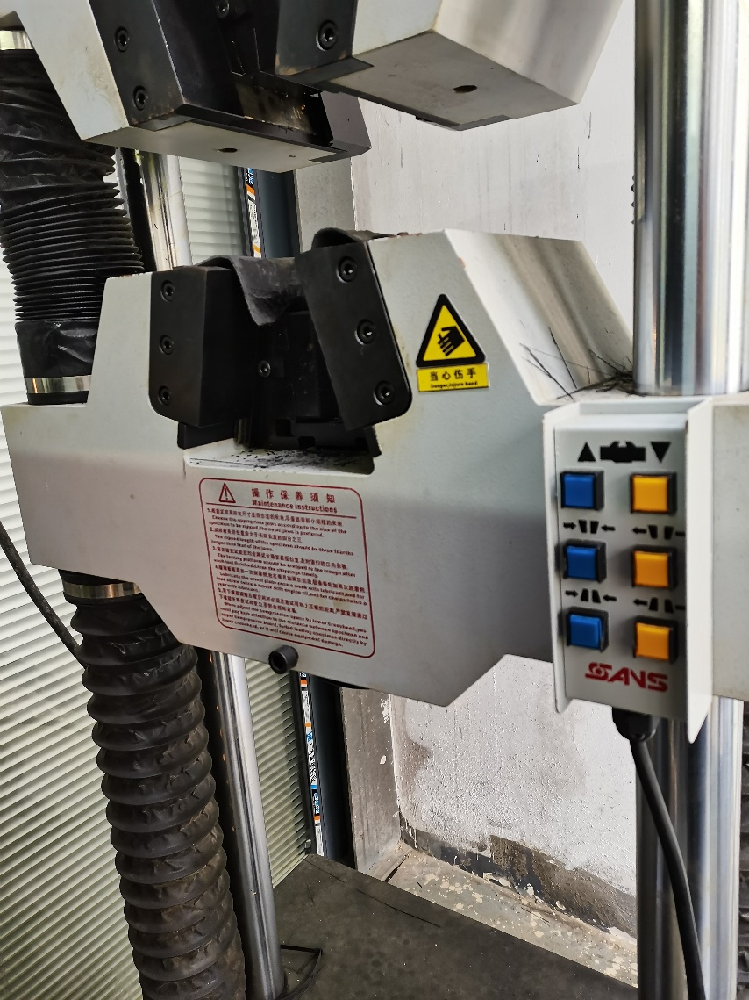
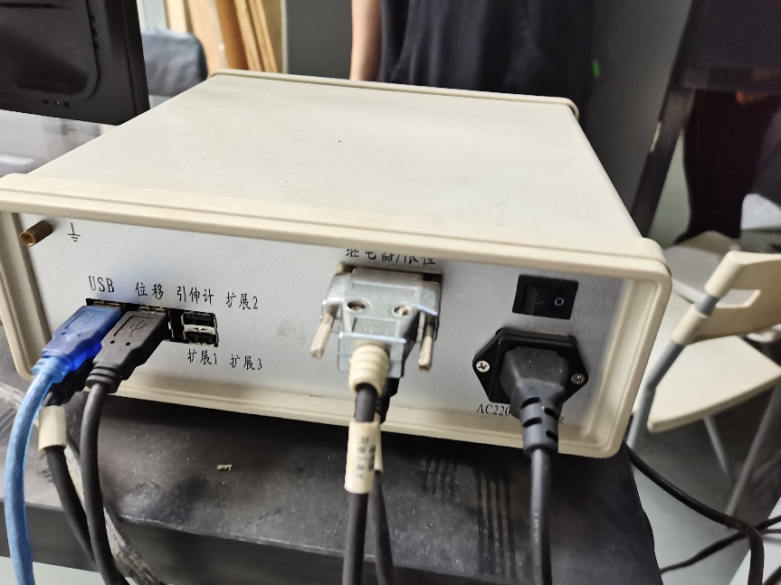
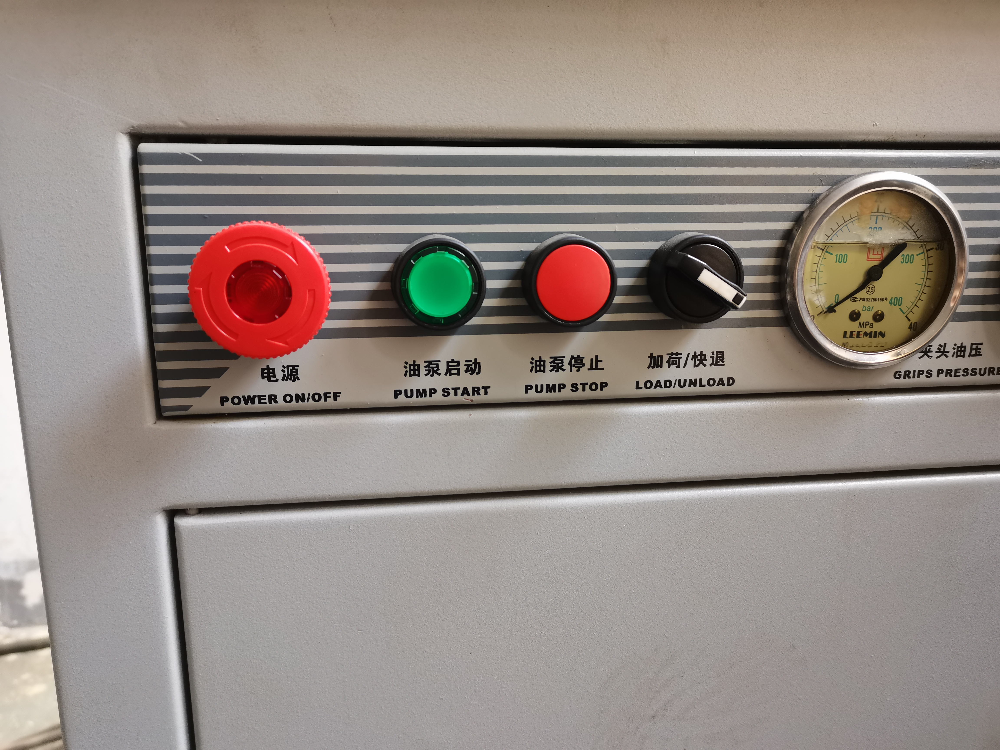
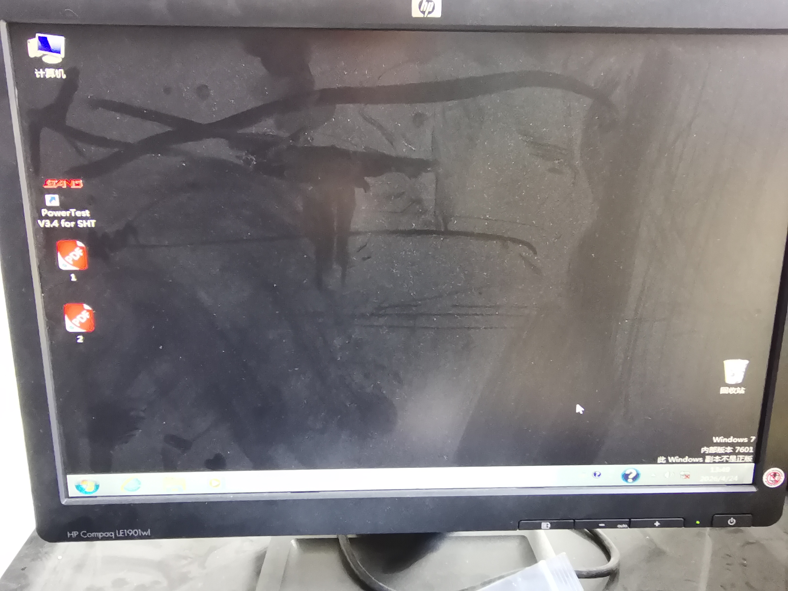
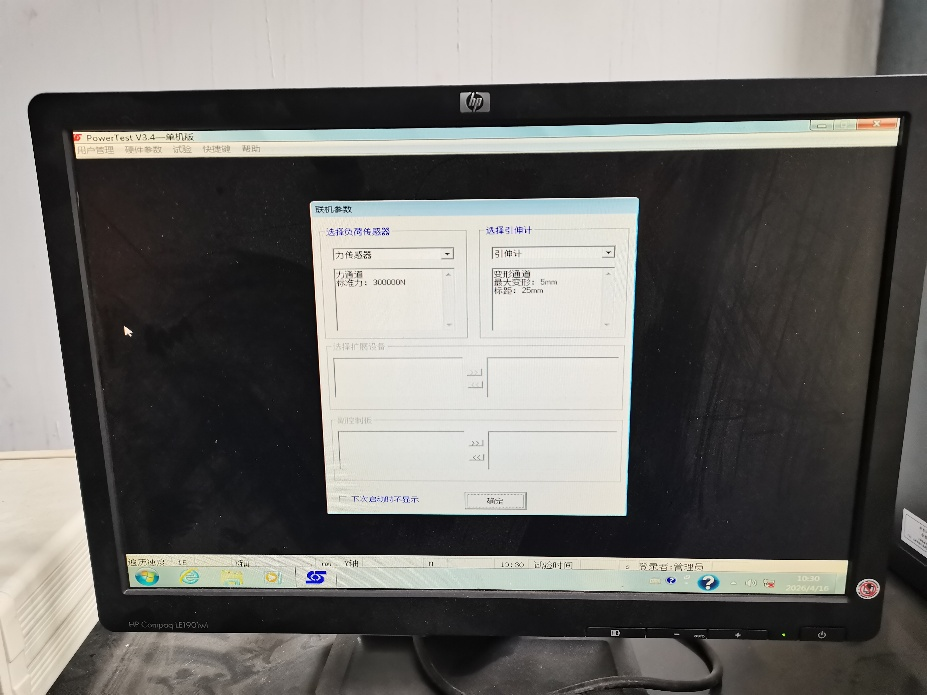
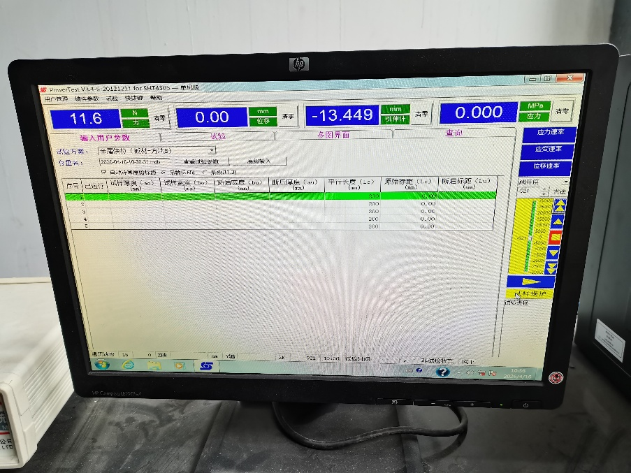
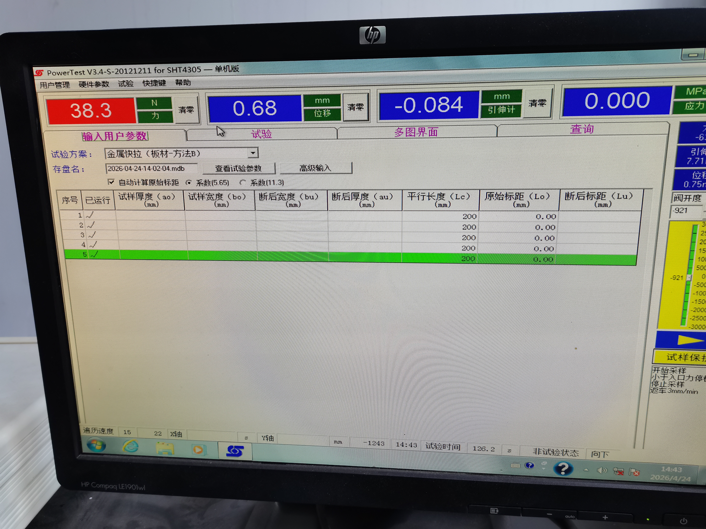
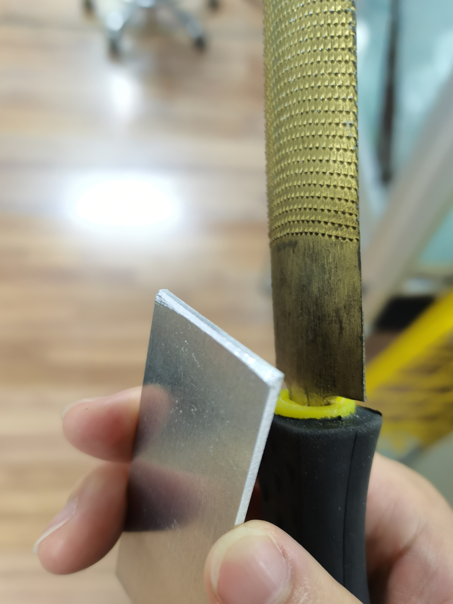
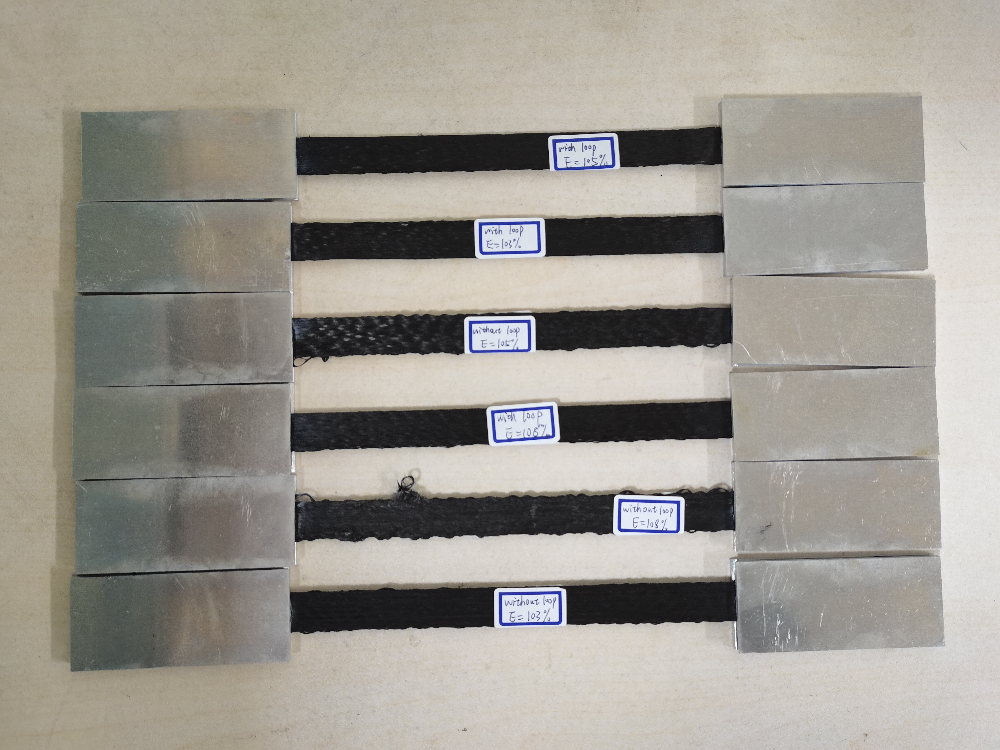

开物馆拉伸机使用说明
=====================

**撰写：** 王实
**审核：** 陆殿雄
**特别感谢：** 傅前亮

----

.. contents:: 目录
   :depth: 2
   :local:

----

一、设备概述
------------

拉伸试验机位于 **开物馆 Y600** 机器放置处。该设备依据 ASTM_D3039 试验标准，用于测定高模量纤维增强聚合物基复合材料的面内拉伸性能，适用于连续纤维或短纤维增强复合材料（层压板需在测试方向上平衡对称）。

   拉伸试验机

试验机右侧控制面板有 6 个按钮，从左至右、从上到下依次为：

.. list-table::
   :header-rows: 1

   * - 按钮
     - 功能
   * - 抬升下夹块
     - 下夹块上移
   * - 降下下夹块
     - 下夹块下移
   * - 关闭上夹块
     - 夹紧上侧
   * - 打开上夹块
     - 松开上侧
   * - 关闭下夹块
     - 夹紧下侧
   * - 打开下夹块
     - 松开下侧

----

二、设备操作流程
----------------

2.1 开机
~~~~~~~~~

**第一步：打开控制系统电源**

将全数字闭环测控系统的电源开关打开（开关在背面）。

   全数字闭环测控系统电源开关

**第二步：启动液压油泵**

   操作开关

从左至右的开关依次为：电源（急停开关）、油泵启动、油泵停止、加荷/快退。

操作顺序：

1. 顺时针旋转旋钮以打开电源
2. 按下 **油泵启动** 按钮

**第三步：打开测试软件**

打开试验机旁的台式机，双击桌面上的 PowerTest 测试软件。

.. note:: 该电脑款式过于老旧，且鼠标接触不良，建议 **自带鼠标** 前往。

   电脑桌面测试软件

打开软件后会进入联机参数选择界面，选择 **默认参数** 即可。

   联机参数界面

进入软件主页面后，选择需要的试验方案。

   测试软件主页面

2.2 试样装夹
~~~~~~~~~~~~~

1. 将操作面板上的旋钮选至 **加荷**
2. 将软件界面中力、位移等 4 项数值 **清零**
3. 点击 **抬升/降下下夹块** 按钮，将下夹块移动到合适位置，使粘接好的样条能放入上下夹块之间
4. 先 **关闭上夹块** 夹紧样条上侧，观察样条是否保持竖直，若否则进行相应调整
5. 确认后再 **关闭下夹块** 夹紧样条下侧（此时样条可能会有些许弯曲，属正常现象）

2.3 测试运行
~~~~~~~~~~~~~

1. 点击 **试样保护**，显示力数值的界面应变红，机器会自动调整位移将试样拉直
2. 待力数值变化平稳后，点击 **开始** 按钮
3. 机器自动按照额定速率拉伸试样，等待完成即可

   试样保护

.. warning:: 机器拉伸过程中 **不要靠近**，以免试样拉断时碎片飞出伤人！

试验结束后：

1. 打开上下夹块，取下拉断后的试样
2. 将旋钮选至 **快退**（关机后再选至 **加荷** 防止下一个人开始实验没有进行）
3. 选择 **暂时不填入数据**
4. 重复装夹步骤进行下一组试验

2.4 数据处理
~~~~~~~~~~~~~

结果文件储存在 ``E:\Program Files\PowerTestV3.4-SHT\data`` 文件夹中：

- 文件以日期时间命名，一般找到 **最新文件** 即为所需结果文件
- 同一打开过程中做的试验归为一组，储存在同一文件中（最多 5 次）
- 若多次开关软件，则会分为多组储存在多个文件中
- 结果文件为 ``.mdb`` 格式，需用 Access 软件打开后另存为 ``.xlsx``

找到目标文件并存储在u盘中

2.5 关机
~~~~~~~~~

1. 停止油泵
2. 按下 **急停按钮** 以关闭电源
3. 关闭全数字闭环测控系统电源
4. 关闭电脑电源

----

三、拉伸测试试验
----------------

3.1 测试介绍
~~~~~~~~~~~~~

本试验依据 **ASTM_D3039** 标准，测定连续碳纤维层压板的面内拉伸性能，为材料研发、质量保证和结构设计提供数据。

3.2 试样制备
~~~~~~~~~~~~~

**试样尺寸**：250mm × 15mm × 1mm（0°单向层压板）

**制备流程**：

1. 设置工艺参数，使用 iFiber 切片生成 Gcode，打印机打印试样
2. 每种测试条件至少 **5 个** 试样
3. 打印完成后测量样条实际尺寸（长度、宽度、厚度）
4. 去济事楼 148 获取金属片与胶水
5. 在样条两端上下表面各用两片金属片粘接固定，保证未粘接区域长度为 **150mm**
6. 粘接后静置 **24 小时**

**注意事项**：

1. 粘接前擦拭金属片表面，不要有灰尘
2. 有预处理液的话尽量在上胶水前涂一点，可提升胶水效果
3. 注意胶水有效日期，开封太久黏性会下降
4. 金属片与样条接触一侧的短边需用砂纸或锉刀打磨形成小倒角

   金属片打磨样图

   粘接后成品图

3.3 测试步骤
~~~~~~~~~~~~~

按第二章所述完成开机、登录软件（方案选"金属快拉—方法B"）后：

1. 力值清零，旋钮选至加荷
2. 将粘好的样条装夹在上下夹块之间，先夹紧上侧，确认竖直后再夹紧下侧
3. 点击 **试样保护**，待力数值稳定
4. 点击 **开始**，机器自动拉伸至试样断裂
5. 结束后取下试样，旋钮转至快退再转回加荷
6. 重复以上步骤进行下一组试验

3.4 结果处理
~~~~~~~~~~~~~

1. 用 Access 打开 ``.mdb`` 结果文件，另存为 ``.xlsx``
2. 用代码绘图展示拉伸长度与拉伸力关系（参考附录程序）
3. 计算拉伸强度
