使用T300进行打印
=======================

3.1 打印前的准备、检查与清洁
---------------------------------

**注意**：

■ 打印开始前，请务必检查丝材是否充足，若需要更换丝材，请按照2.3步骤进行。

3.1.1 打印机工作环境检查
~~~~~~~~~~~~~~~~~~~~~~~~~~~~~

打印机应置于干燥、清洁的工作环境中，避免在高温、潮湿及灰尘较大的环境中工作。打印机应置于坚固、稳定、平整且干燥的表面，并确保打印机稳定地置于表面上，不发生晃动，以防止打印机高速工作时造成工作台及设备的剧烈震动。避免较尖锐的物品接触打印机表面，以免造成损伤。

3.1.2 清洁热床
-------------------

打印开始前，需要清洁热床，防止打印受到上一次打印的残留基体的影响。
清洁流程参考下列步骤：

- 室温条件下，将打印板从热床上取下

- 使用铲刀把热床表面黏附的基体或纤维残留物清理干净

- 用水或者酒精清洗打印板表面，然后使用无纺布擦干

- 将打印板放回热床，加热至 60~80度之间

- 带上防护手套（隔热），取下打印板，再打印板表面均匀的喷涂3D打印平台喷雾

- 放回打印板

- 如使用其他款式的胶水或平台喷雾，请参考厂商给出的使用指南，平台喷雾可以使首层与打印板的结合更加牢固，同一区域喷雾的效果可维持五次打印

3.1.3 清洁喷头
~~~~~~~~~~~~~~~~~~~~~~~~~~~~~

打印头开始运动前，需要清洁两个喷头，（可使用刷子或镊子），防止喷嘴上黏附基体，导致归位的误差，从而引起打印失败。

清洁基体喷嘴时，需要将基体喷嘴升温到打印温度，待喷嘴表面黏附的基体融化后，使用刷子将其刷去即可。

清洁纤维喷嘴时，若喷头上可见挤出的纤维，可按照2.3.2中的操作步骤剪断纤维，参见图2.28，2.29。然后使用镊子把这段纤维夹出。

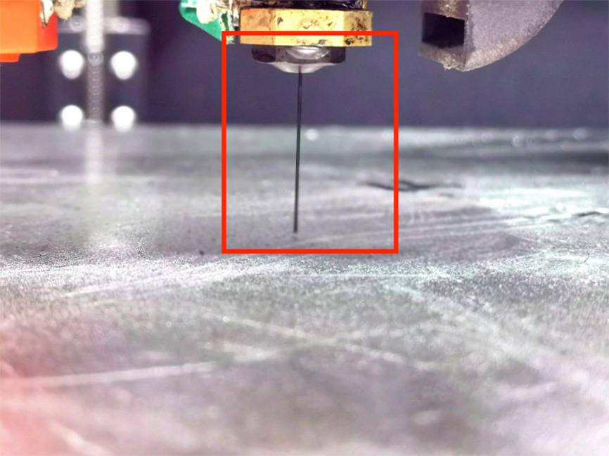

  图3.1 喷头上有残留纤维

3.2 打印模型的准备
-------------------------

3.2.1 处理模型文件
~~~~~~~~~~~~~~~~~~~~~~~~~~~~~

在打印前，请先准备零件的数模，stl格式。

可以使用Solidworks软件进行建模，或者将已有模型导入Solidworks软件进行格式转换。将其他格式建模文件转换或另存为stl格式时，请点击“选项”按钮，保证“不要转换STL输出数据到正的坐标空间”选项被勾选。

该选项会保留原始坐标信息，以便后续使用Solidworks导出零件DXF时，坐标能够匹配。

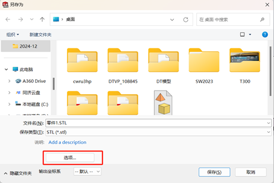

  图3.2 SolidWorks另存为界面

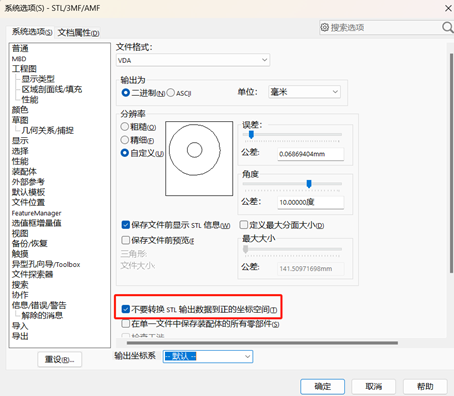

  图3.3 需要勾选的选项

3.2.2 模型文件切片
~~~~~~~~~~~~~~~~~~~~~~~~~~~~~

**注意**：

■ iFiber软件的详细使用说明可参考《连续纤维切片软件使用指南》。

使用T300打印时，可以使用Cura、Prusa Slicer、Super Slicer、Simplify3D、Orca Slicer等切片软件（RepRap风格，且需要修改start.gcode以及end.gcode适配打印）或者iFiber（开箱即用），需要打印连续纤维复合材料零件的时候，只能使用iFiber。

按照使用指南使用iFiber对零件进行切片设置后，得到零件的Gcode文件。

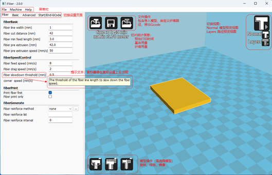

  图3.4 iFiber软件界面

3.2.3 打印文件上传
------------------------

按照如下步骤上传Gcode文件：

- 使用电脑访问打印机管理界面（在浏览器界面输入打印机IP地址自动跳转）

- 向下翻动界面，找到任务列表区域（图3.5），点击任务列表标题下方的“+”，选择“上传文件”选项

- 找到切片获得的Gcode并双击（图3.6）。Gcode上传成功后会添加进任务列表

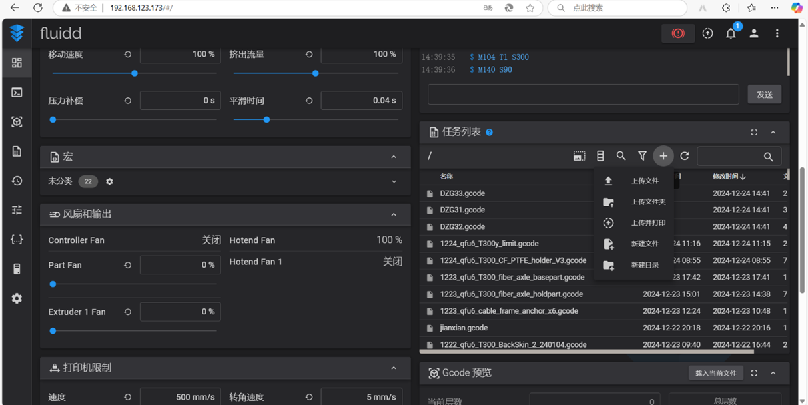

  图3.5 上传文件

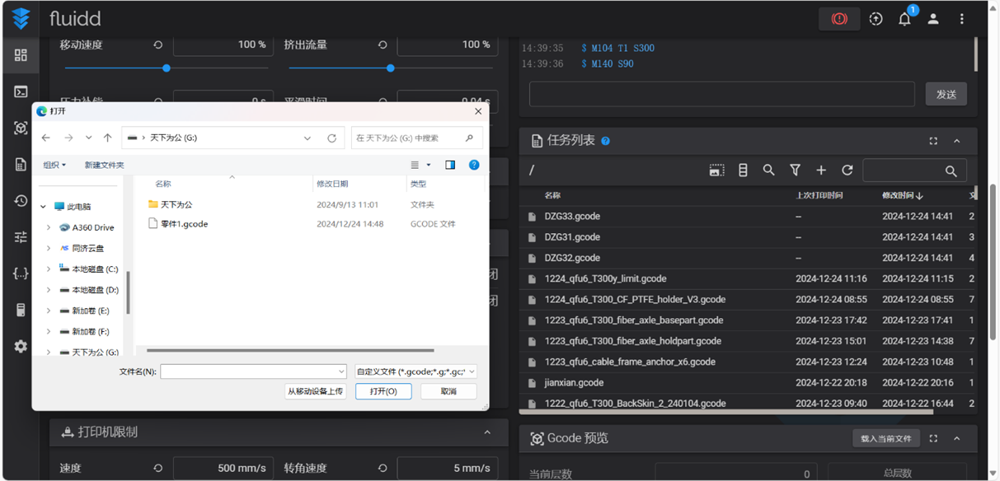

  图3.6 选择Gcode文件

3.3 喷头与热床的温度设置
-----------------------------

进入触摸屏初始界面，点击“Temperature”选项，然后点击“nylon_ccf_heating”选项（图3.7）。该选项适用于PA-CF基体和PET-CF基体以及PA基连续碳纤维预浸丝。

加热后请注意安全，避免直接接触热源。

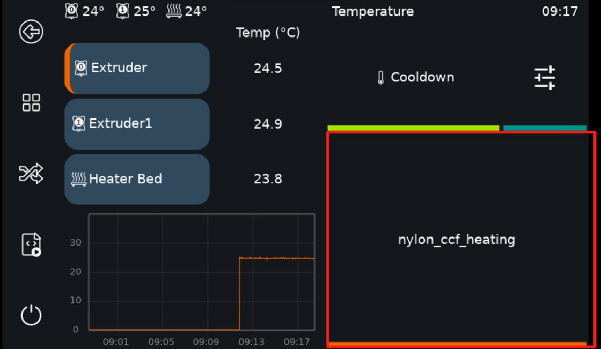

  图3.7 自动升温选项

若需要自定义打印温度，可分别点击左侧的三个温度数字，输入所要设定的温度数值即可（图3.8）。如需冷却，可以将温度设置为0，或者点击图3.7中的Cooldown按钮。

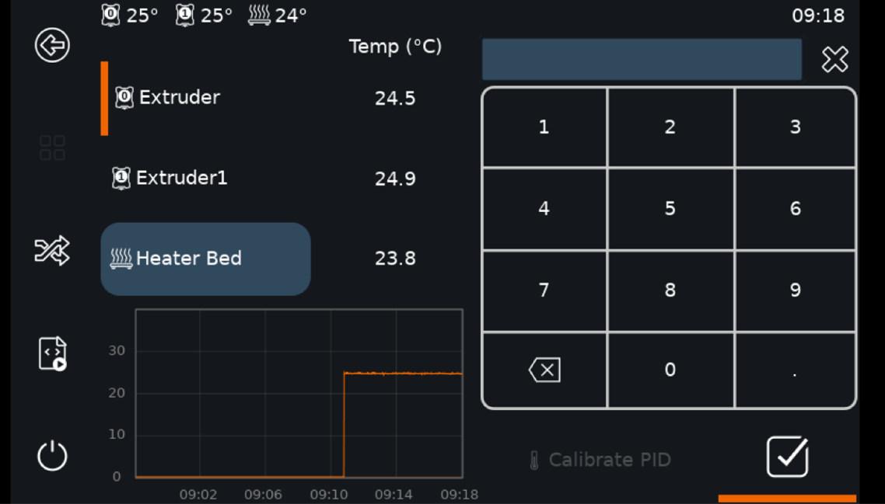

  图3.8 手动升温选项

3.4 归位所有轴
---------------------

在打印机移动开始前，必须对所有轴进行归位。

**在正式打印开始前，应该在预设的打印温度下进行归位、自动调平和网床补偿，以排除喷嘴、热床热膨胀带来的z轴定位误差，调整时务必保证喷嘴清洁。**

进入触摸屏初始界面，点击“Move”选项并找到“Home”命令（图3.9），然后在跳转进入的页面内点击“Home All”命令（图3.10），打印机即会自动开始Home定位。

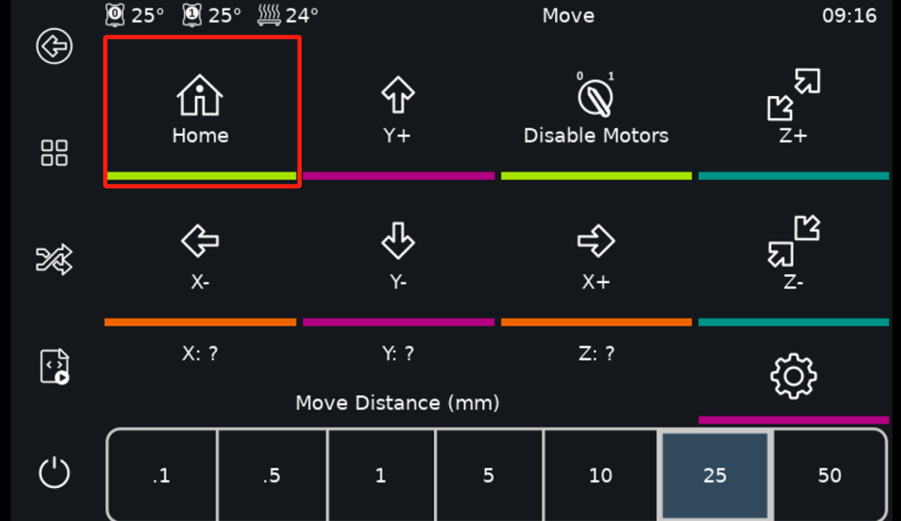

  图3.9 Move界面

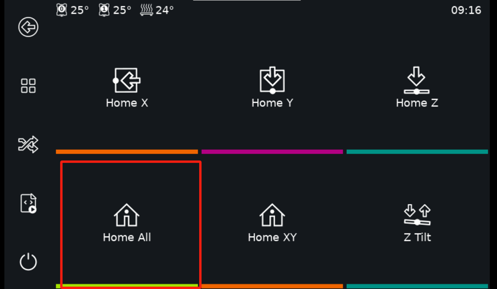

  图3.10 HomeAll命令

3.5 选择文件并打印
------------------------

进入初始界面后，点击“Print”选项，找到上传的Gcode并点击（图3.11），确定要打印的Gcode后点击“Print”（图3.12）。T300打印机即会开始进行打印，触摸屏会显示打印运行时的界面（图3.13）。

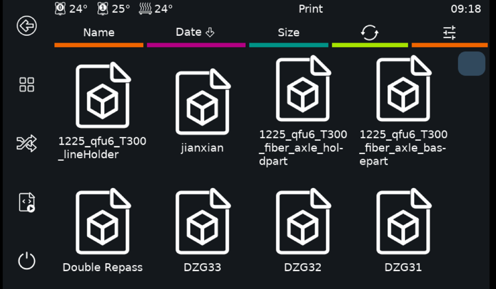

  图3.11 选择Gcode

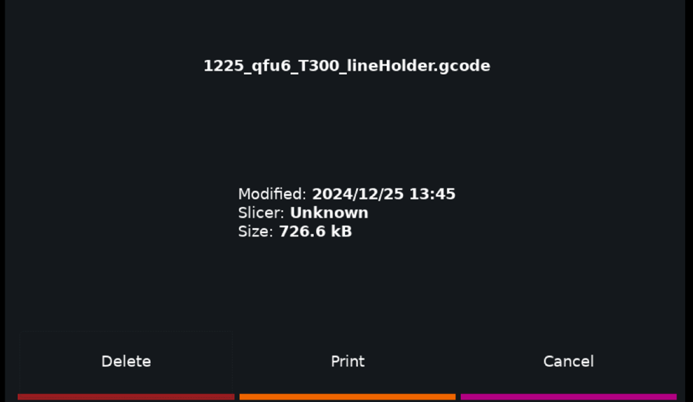

  图3.12 确定要打印的Gcode

打印开始后，屏幕界面中展示了打印机的一些实时数据，如两个喷头与热床的温度、实际/预设打印速度、挤出机的流量、打印头高度等。

主要按钮的名称及功能如下：

.. list-table::

   * - Pause
     - 暂停，打印暂停，保留打印过程中的状态，直至恢复或取消打印
   * - Cancel
     - 取消，打印取消
   * - Settings
     - 取消，打印取消
   * - Fine Tuning
     - 微调，对打印过程进行微调

有关打印界面及其相关操作的更多信息，请参考 `klipper screen 官方文档 <https://klipperscreen.readthedocs.io/en/latest/#about-the-project>`_ 。

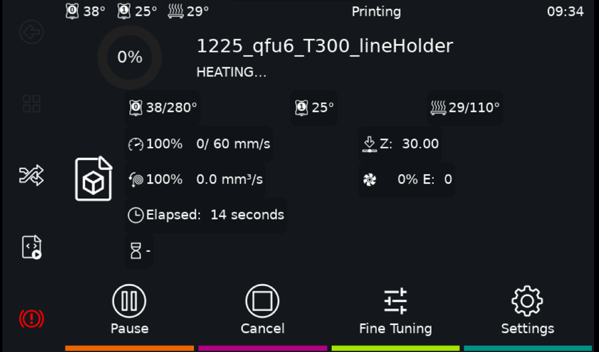

  图3.13 打印运行界面

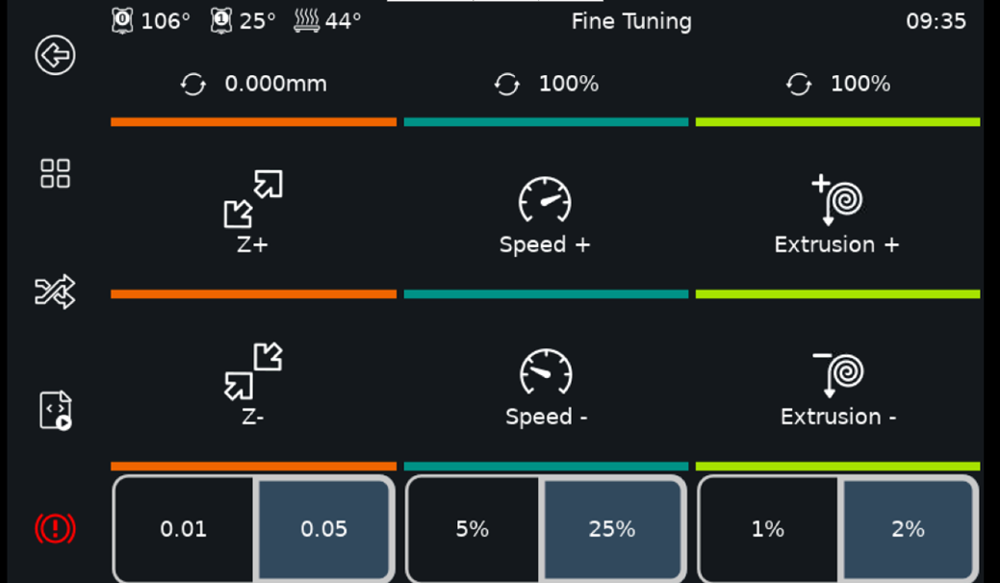

  图3.14 微调界面

3.6 收取3D打印零件
--------------------

注意：

■ 打印完成后，请勿立即断开电源

■ 待打印头温度降至接近室温（热端风扇停止转动时）后再断电

■ 否则可能造成基体打印头喉管堵塞。

打印完成且热床已冷却到室温后，可以使用铲刀将零件与打印板分离，或者取下打印板，弯曲打印板将零件取下。收取零件后请按照3.1.2，3.1.3中的操作对热床和喷头进行清洁。
