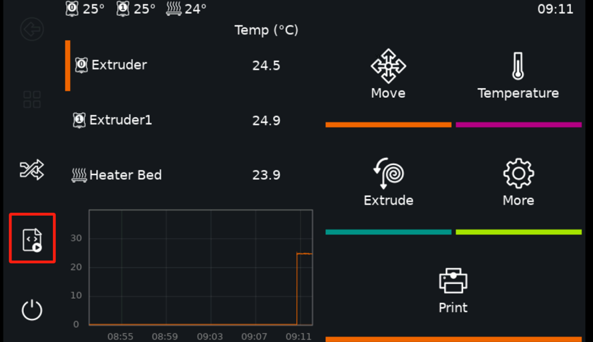
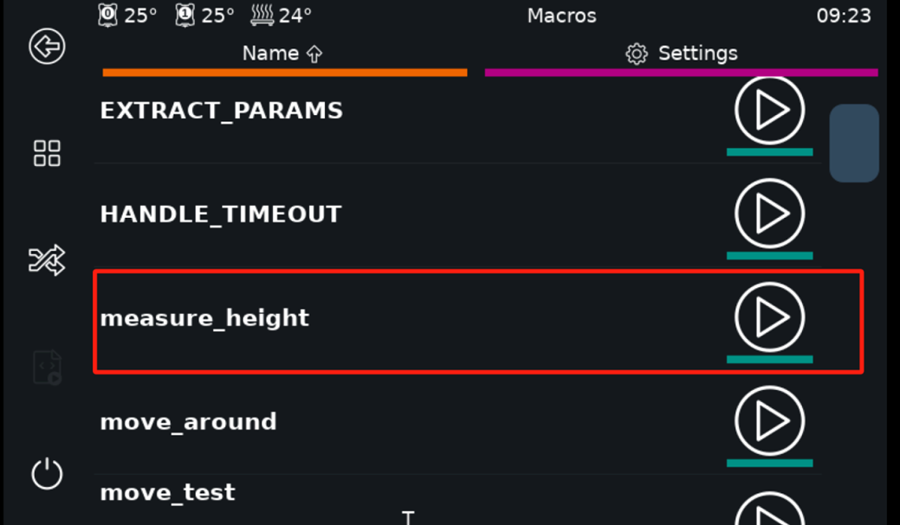
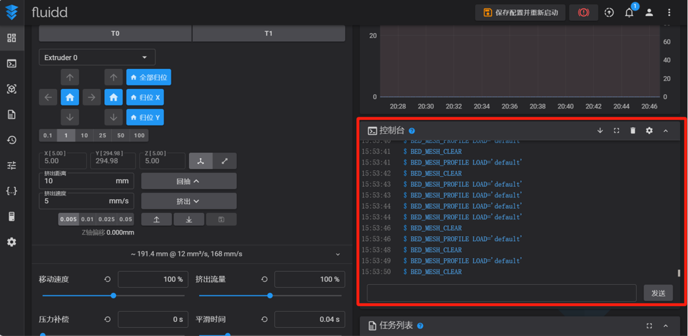
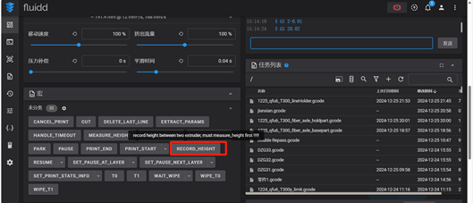
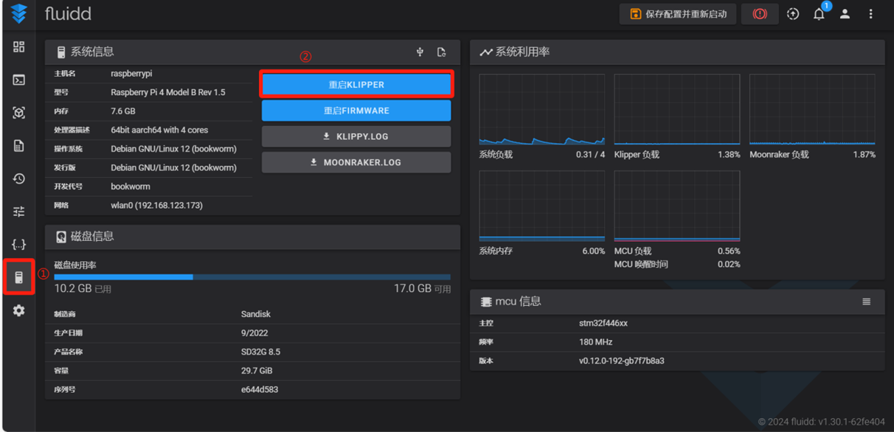
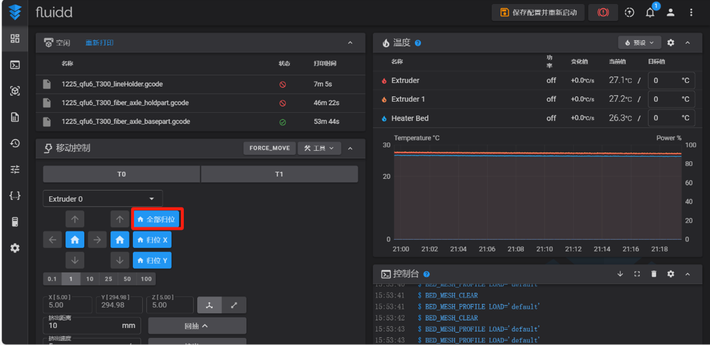
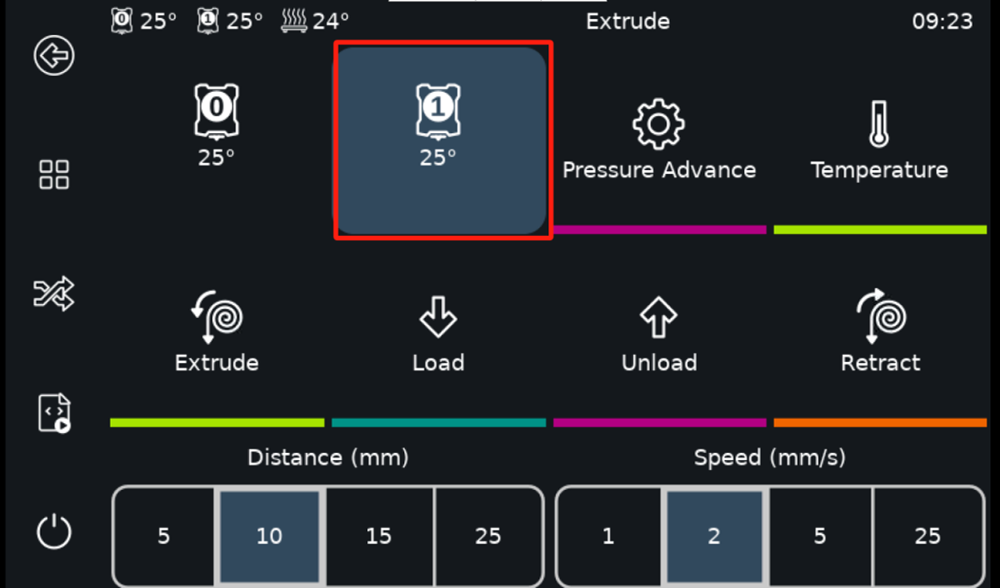
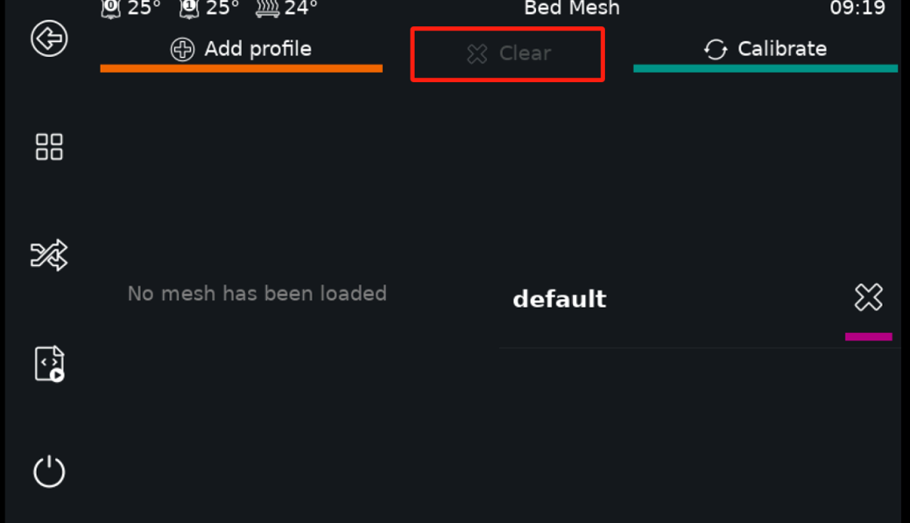
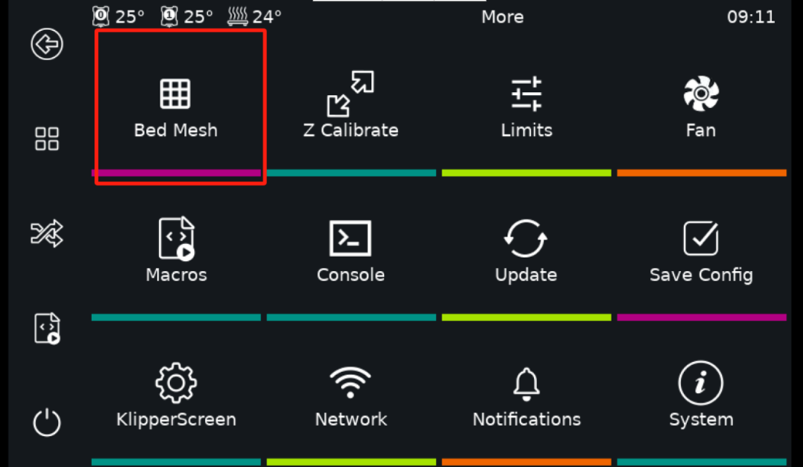
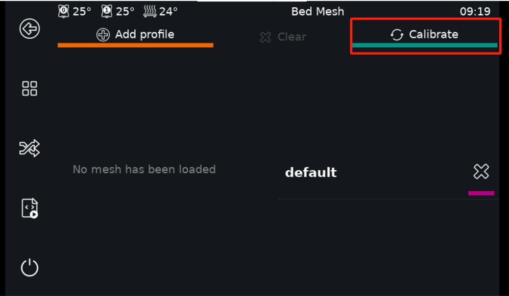

初次打印前的准备
=====================

注意
------
■ 请不要在打印机热床、挤出头运动空间内放置任何物品。打印机工作前，请检查打印机内是否有可能影响打印机部件运动的物体。如有，请在使用前移除。

2.1 连接打印机
---------------------

T300 使用树莓派（Raspberry Pi）作为上位机，可通过局域网进行连接。树莓派启动后会自动连接到预设的 WiFi 网络。具体连接步骤如下：

1.配置树莓派WiFi网络连接：

- 使用手机、电脑或路由器，设置移动热点或 WiFi 网络，确保网络设置为以下参数：

  - **SSID**: WAGZ
  - **密码**: wagzwagz
  - **频段**: 2.4GHz 或 5GHz
  - **协议**: IPv4

- 树莓派将在开机后自动连接到此局域网。

2. 确保设备连接在同一局域网：

- 在配置完成后，确保电脑与树莓派处于同一无线局域网下。

3. 访问 T300 机器管理界面：

- 若已知树莓派的 IP 地址，直接在浏览器的地址栏中输入该 IP 地址即可访问 T300 的机器管理界面，如下图2.1所示。

    .. figure:: image/T300机器管理页面.png
       :align: center
       :name: 图2.1

       图2.1 T300机器管理页面

- 若未知树莓派的 IP 地址，可通过开启热点的电脑、手机、路由器设置界面查看，也可通过机器的触摸屏查询。进入主界面后（图2.2），点击 **More** 选项，然后点击 **Network** 选项（图2.3），就可以在上方看到树莓派的 IP 地址（图2.4）。

    .. figure:: image/触摸屏主界面.png
       :align: center
       :name: 触摸屏主界面

       图2.2 T300机器管理页面

    .. figure:: image/点击More选项后，找到Network选项.png
       :align: center
       :name: 点击More选项后，找到Network选项

       图2.3 点击More选项后，找到Network选项

    .. figure:: image/找到ip地址.png
       :align: center
       :name: 找到ip地址

       图2.4 找到ip地址

4. 修改树莓派 WiFi 网络连接信息：

- 在图2.4的网络设置界面，选择已有 WiFi，点击右侧的右箭头按钮，输入 WiFi 密码，点击保存。树莓派随后会自动连接到此 WiFi。

2.2 打印机初始化
-----------------

在基体打印或者连续纤维打印前，需要对打印机的基体打印头（以下简称为 M 头）和连续纤维打印头（以下简称为 F 头）进行 Z 轴方向上的零点校准，用于确定两个喷头之间的高度差和零点位置。
当更换了打印机上的易损耗部件后（如更换了纤维喷嘴、基体喷嘴），才需要重新对打印机的设置进行重新校准（重新测量高差等）。

2.2.1 双喷头 Z 轴零点定位
~~~~~~~~~~~~~~~~~~~~~~~~~~

注意：

■ 机器出厂时已经进行过双喷头的零点校准，初次使用可以跳转到 2.2.2 节

■ 在进行 Z 轴校准时，需要使用一张 A4 纸作为辅助工具

1. 校准基体头 Probe Z offset：

- 进入初始界面后（图2.2），点击 “More” 选项，然后点击 “Z Calibrate” 选项（图2.5），然后点击 “Start” 按钮（图2.6），即开始校准。

    .. figure:: image/zCalibrate界面.png
       :align: center
       :name: zCalibrate界面

       图2.5 zCalibrate界面

    .. figure:: image/zCalibrate校准前界面.png
       :align: center
       :name: zCalibrate校准前界面

       图2.6 zCalibrate校准前界面

- 进入操作界面（图2.7），功能说明如下：

    - **Raise Nozzle**：抬起喷头，等效于热床下降。
    - **Lower Nozzle**：降下喷头，等效于热床上升。
    - **Move Distance**：抬起/降下喷头的高度。共有6个数值可供选择，分别为0.01mm、0.05mm、0.1mm、0.5mm、1mm、5mm。
    - **Accept**：操作完成后的确定键。
    - **Abort**：取消键。

    .. figure:: image/zCalibrate校准中界面.png
       :align: center
       :name: zCalibrate校准中界面

       图2.7 zCalibrate校准中界面

- 在热床上放置 A4 纸，选择合适的 "Move Distance" 并点击 "Lower Nozzle" 按钮。直至在抽动 A4 纸时感觉阻力既没有大到压着 A4 纸无法动弹，也没有小到 A4 纸可以较为轻松地移动，此即为合适高度。点击 "Accept" 按钮。M 头 Z 轴零点定位完成。操作过程亦可参考 `#the-paper-test <https://www.klipper3d.org/zh/Bed_Level.html#the-paper-test>`_ 。

    .. figure:: image/A4纸测试.png
       :align: center
       :name: 图2.8

       图2.8 A4纸测试

2. 校准纤维头 Probe Z offset：

- 在主页面，点击左侧列表中间的图标（图2.9），在下拉列表中找到 “measure_height” 指令（图2.10）并点击。

- 等到热床下降后，接着回到图2.1 所示界面，找到控制台区域（图2.11）在输入框中输入以下命令：

.. code-block:: gcode

    SET_SERVO SERVO=servo_lift ANGLE=20
    G91

- 放置一张 A4 纸在热床上。使用下面的指令移动热床位置：

.. code-block:: gcode

    G1 Zx
    ; x 为一个数值，正表示热床下降，负表示热床上升
    ; 使用这样的指令代替之前的 Raise Nozzle 和 Lower Nozzle 操作

- 滑动 A4 纸直至达到与进行基体头 Probe Z offset 校准时相同的阻力。

- 完成上述指令后，先在控制台区域输入指令：

.. code-block:: gcode

     G90

- 在控制台区域的左下角找到宏区域，点击其中的 “RECORD_HEIGHT” 命令（图2.12）。此命令也可以在图2.10 的下拉列表中找到。

- 完成测量，按照图2.13 指示，重新启动 T300 以应用所有设置。

   图2.9 进入宏指令部分

   图2.10 点击measure_height指令

   图2.11 控制台区域

   图2.12 RECORD_HEIGHT宏命令

   图2.13 重启打印机

3. 验证零点校准效果：

- 机器重启后，首先需要归位所有的轴，可以在移动控制区域点击全部归位（图2.14），也可按照本说明书步骤 3.3 进行操作。

   图2.14 使用Web控制机器归位所有轴

- 在图2.2 所示界面，点击 “Extrude” 选项，然后点击 F 头（图2.15）（此前的所有操作都应该处于 M 头的选择下）。控制台中会提示 T1 打印头已经激活。

- 放置一张 A4 纸在热床上。

- 在控制台区域的输入框中输入以下命令：

.. code-block:: gcode

     G90
     G1 Z0

- 滑动 A4 纸，判断此时纸张的阻力是否与前文中提到的校准步骤中的阻力相似。若相似，则证明零点校准成功。若阻力过大（纸张划破）、无阻力则需要重新校准。

- 在图2.2所示界面，点击“Extrude”选项，然后点击M头（图2.15红框左侧按钮）。控制台中会提示T0打印头已经激活。

- 可以按照本节中相同步骤验证基体头零点，不再赘述。

   图2.15 选择纤维打印头

2.2.2 喷头间高度差测量
~~~~~~~~~~~~~~~~~~~~~~~~~~

因为以 M 头作为参考标准系，所以在定位 M 头后才能对 F 头进行定位，同时只需要知道 F 头相对 M 头的高度差即可。

在初始页面，点击左侧列表中间的图标（图2.16），在下拉列表中找到 “measure_height” 指令并点击，等待高差测量完成，热床自动下降。

更换喷嘴后需要重新进行高差测量，测量前需要保证喷嘴上没有粘附基体。

   图2.16 measure_height操作示意

2.2.3 热床自动调平
~~~~~~~~~~~~~~~~~~~~~~~~~~

为保证打印时零件的平整，需要保证热床首先是尽量水平的。根据三点确定平面的原理，在打印开始前需要对热床进行调平，调平前确保归位了所有轴，且喷嘴上无黏附基体。

在触摸屏的初始界面，点击 “Move” 选项，找到 “Home” 命令并点击（图2.17），点击 “Z Tilt” 命令（图2.18）。点击后，喷头会自动在热床上进行取点，然后根据取点结果对热床平台进行微调，如此重复多次。只需要在点击 “Z Tilt” 命令后等待机器操作结束即可。

   图2.17 Home菜单

   图2.18 调平按钮

另外需要注意的是，在进行三点调平操作时，需要确保Bed Mesh功能关闭，否则会产生干涉。关闭Bed Mesh的步骤是在图2.19所示界面中，点击“Clear”命令，如果“Clear”命令是灰色，即代表Bed Mesh功能已关闭。

   图2.19 关闭BedMesh

2.2.4 网床补偿
~~~~~~~~~~~~~~~~~~~~~

热床并不是一块完全水平的平面，而是一个在不同位置有不同起伏的曲面。为了避免这种曲面造成的高低差对打印件的开始几层材料造成倾斜度影响，需要对这些高低差进行补偿，保证首层在同一水平高度，此即为网床补偿（Bed Mesh）的作用。

进入初始界面后（图2.2），点击“More”选项，然后点击“Bed Mesh”选项（图2.20）。Bed Mesh命令默认是关闭的，这时点击右上方的“Calibrate”命令（图2.21），即可开始自动运行Bed Mesh。待机器自动运行结束后，平板界面会出现图2.22所示的确认界面，这时点击“Accept”即可，然后打印机会重启，网床参数会写入到配置文件中。

   图2.20 点击More选项后，找到BedMesh选项

   图2.21 点击Calibrate命令运行

.. figure:: image/运行结束后确认.png
   :align: center
   :name: 图2.22

   图2.22 运行结束后确认

2.3 更换打印机耗材
----------------------

2.3.1 基体材料换料
~~~~~~~~~~~~~~~~~~~~~~~~~

**注意**：

- 操作时务必远离喷嘴与热床，以防烫伤！

- 加热结束后，需将喷嘴温度冷却到接近室温，再断开电源。

- 请检查基体丝材直径。本打印机使用直径 1.75mm 基材。

- 请检查连续碳纤维丝材直径。本打印机使用直径 0.4mm 连续碳纤维丝材。

1. 退出旧耗材：

   - 先将喷头升温至旧耗材的推荐打印温度。

   - 加热至指定温度后，触摸屏切换到图2.15 中展示的挤出界面，选择较低的挤出速度 5mm/s，较长的挤出距离 25mm。

   - 先点击挤出（Extrude），然后迅速选择较高的挤出速度 25mm/s，点击Retract。

   - 操作期间应该观察到耗材从喷嘴中缓慢挤出，然后停止，不再漏料。

   - 按照图2.24 所示箭头方向按住压紧开关，然后抽出旧耗材。

   .. figure:: image/拨动塑料头压紧开关.png
      :align: center
      :name: 图2.24

      图2.24 拨动塑料头压紧开关

2. 处理新耗材：

   - 使用斜口钳等工具，将新耗材剪成 45° 角，以便进入特氟龙管（挤出机构内部通道），截面形状如图 2.26 所示。

   - （可选）将耗材置于密闭容器中，并加入适量干燥剂，防止丝材受潮。已开封长期未使用的耗材，建议按照厂家推荐参数烘干后使用。

   .. figure:: image/切割塑料耗材.png
      :align: center
      :name: 图2.25

      图2.25 切割塑料耗材

   .. figure:: image/切割截面形状.png
      :align: center
      :name: 图2.26

      图2.26 切割截面形状

3. 送入新耗材：

   - 将喷头升温至耗材的推荐打印温度。如果旧耗材的打印温度比新耗材高，则要设置为旧耗材的最低打印温度。如果旧耗材的打印温度比新耗材的温度高得多，则应该选择一种介于两个材料打印温度之间的过渡耗材，先按照本节步骤更换为过渡耗材，再重复操作一遍更换为新耗材。

   - 按照图 2.24 所示箭头方向拨动塑料头对应软管的进入端的压紧开关。用食指抵住弹簧部分，然后用大拇指去拨动一旁的黑色拨片。（需要按住拨片，此过程的阻力较大，请注意黑色拨片的移动幅度较小。拨动黑色拨片后即打开了压紧开关）

   - 将之前切割完成的塑料丝插入拨片旁的小孔，使耗材进入特氟龙管。继续向里送入塑料耗材（在进入打印机喉管时应该会有一次明显的阻力感，此时停顿一下继续送入耗材），直至观察到喷头有塑料挤出。

   - 停止按住拨片，在触摸屏上操作基体头挤出较长距离的塑料，将旧料冲刷干净。

2.3.2 连续碳纤维丝材上料
~~~~~~~~~~~~~~~~~~~~~~~~~~~~~

纤维材料不易受潮，所以使用时一般不需要干燥。连续纤维材料具有一定的刚度，收纳不当容易炸卷，务必注意。

上料时按图 2.27 指示，按住开关。将丝材插入小孔后一直送丝直至喷头有纤维穿出。然后松开开关。

   .. figure:: image/拨动纤维头压紧开关.png
      :align: center
      :name: 图2.27

      图2.27 拨动纤维头压紧开关

进入触摸屏初始界面，点击 “More” 选项，然后点击 “Console” 选项（图 2.28），进入控制台命令行。点击下方输入框，输入 “cut” 命令并点击 “send”（图 2.29），打印机会进行纤维剪切（也可以通过 Web 界面的控制台输入 cut，效果相同）。移除被切断的碳纤维，此时丝线已经加载到了合适的位置，上料完成。

   .. figure:: image/点击More选项后，找到Console选项.png
      :align: center
      :name: 图2.28

      图2.28 点击More选项后，找到Console选项

   .. figure:: image/控制台命令行.png
      :align: center
      :name: 图2.29

      图2.29 控制台命令行