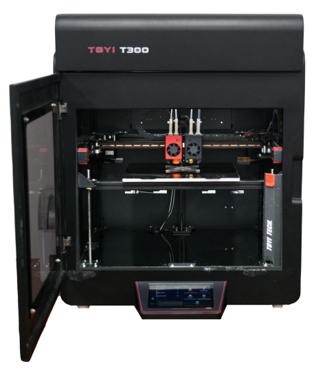

概述
========

1.1 产品特色
-------------

桌面级设计，工业级性能

1. **创新专利技术**：采用独创的柔性远端控制技术，结合超轻量化打印头设计，确保运动控制更加准确。同时，双喷头自动调平与网床补偿技术的专利应用，提升了打印稳定性与精度。

2. **智能打印头控制**：具备双喷头智能切换与自动剪断功能，支持连续纤维的高速稳定进给，确保打印过程中的高效与一致性。

3. **广泛的应用场景**：适用于科研以及日常打印需求，满足不同用户的多元化应用需求。

产品结构及外型如图1.1所示：

   图1.1 T300打印机

1.2 产品参数
-------------

.. list-table::

   * - 打印工艺
     - 熔融沉积成型（FDM）
   * - 成型尺寸
     - 300mm×300mm×250mm
   * - 工具头模块
     - 独立双喷头（基体工具头M头、纤维工具头F头）
   * - 支持材料
     - 基体：1.75mm PLA、Nylon、PETG等材料及其含纤增强材料
   * -
     - 纤维：0.4mm Tyber 1K PA基连续碳纤维预浸润丝材
   * - 运动结构
     - CoreXY、独立3Z
   * - 最高运动速度
     - 300mm/s
   * - 运动精度
     - 打印层厚最小分辨率：50μm； XY运动精度：10μm； Z运动精度：1μm
   * - 最高喷头温度
     - 基体工具头：300℃； 纤维工具头：310℃
   * - 适配软件
     - iFiber（基体及连续纤维），Cura、Prusa Slicer等（仅基体）
   * - 支持文件格式
     - STL文件
   * - 操作方式
     - 局域网无线控制或7寸触摸屏
   * - 调平方式
     - 全自动热床调平、双头零点自动校准
   * - 纤维剪切
     - 支持
   * - 断电续打
     - 支持
   * - 框架
     - 铝合金
   * - 外壳
     - 全封闭机箱（金属 & 玻璃）

