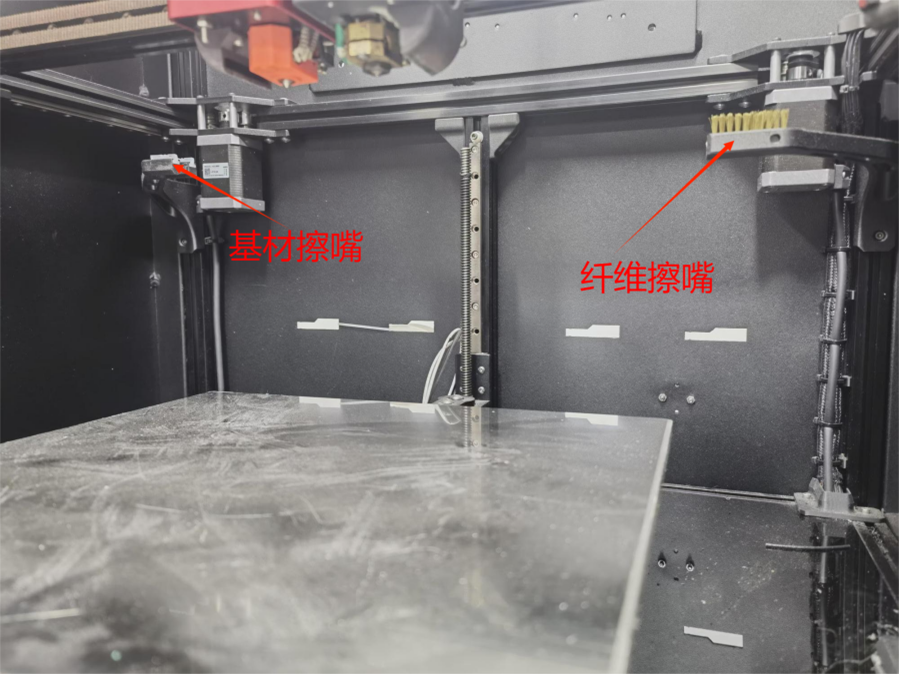

设备的维护及保养
===================

4.1 运动部件的保养与维护
------------------------

T300打印机的运动件包括轴承、导轨、同步带、丝杆螺纹等。为了确保运动的精确性，以及保证运动件有足够的寿命，请在使用中注意以下几点：

- 请勿用手直接触碰导轨侧面、丝杆，以防止其生锈。建议在丝杆、导轨表面涂抹适量润滑脂。

- 如需要拆卸运动件，请务必小心，不要让运动件运动超出其设计的行程，防止其失效。

- 请避免过度用力拉、扭同步带，以防同步带松弛。

- 请务必定期检查同步带张紧力和运动件表面情况。可以通过调节同步带张紧旋钮，调节同步带张紧力。

4.2 喷嘴的保养与维护
--------------------

打印机喷嘴是典型的易损耗部件。

在使用过程中，与打印件、耗材摩擦，会造成磨损或者内部堵塞（尤其在使用短纤耗材的时候）。当基体挤出的路径不均匀时，应该尝试使用通针疏通喷嘴。或拆下喷嘴对其内部进行清理。需要定期检查喷嘴的工作状况，并及时更换磨损过度的喷嘴。

4.3 喷头擦嘴保养及维护
----------------------

请定期检查打印机内基材喷头擦嘴装置及纤维喷头擦嘴装置。若基体擦嘴出的硅胶条出现明显缺口，则需要更换。若纤维擦嘴装置上布满了残留基体，应清洁刷子或更换。

   图4.1 两个擦嘴装置

4.4 打印机的校准
----------------

打印机在长期未使用、连续使用一段时间或出现首层基体、首层纤维打印问题时，应对打印机进行重新校准。校准步骤请按照2.2章节中提示进行。

4.5 安全注意事项
----------------

注意：

■ 请在任何时候注意安全，并且严格按照说明书操作此设备。

■ 在工作时，请避免手指、衣物等靠近运动部件，以免造成人身伤害或设备损伤。

■ 任何检修、拆卸、擦拭、搬动过程，如无特别要求，请按照正常程序断电后再操作。

■ 请勿热插拔任何电子元件。电子元件接口等请避免频繁插拔。

■ 请不要在打印机热床、挤出头运动空间内放置任何物品。打印机工作前，请检查打印机内是否有可能影响打印机部件运动的物体，如有，请在使用前移除。
