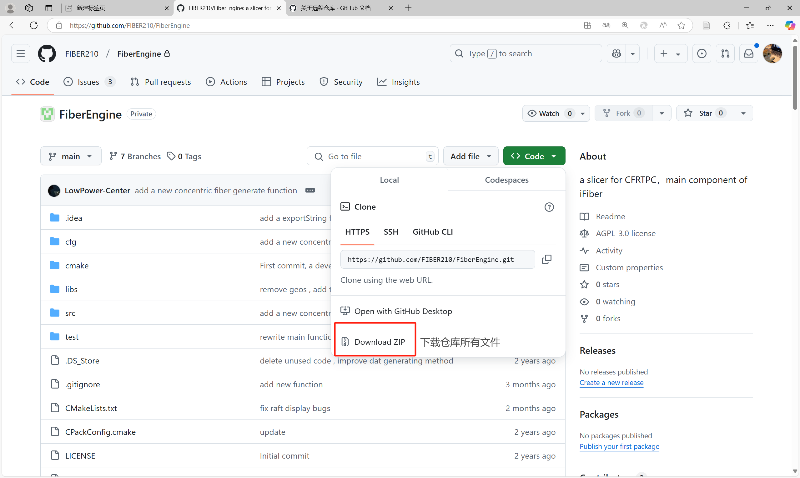
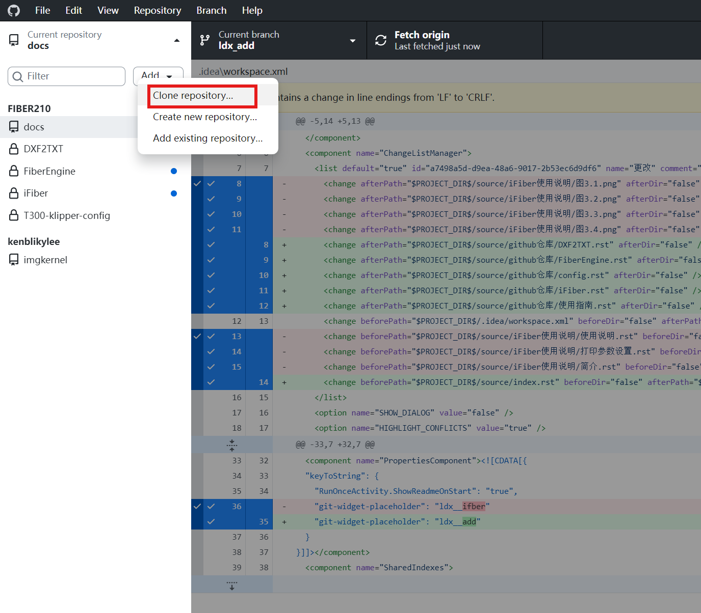
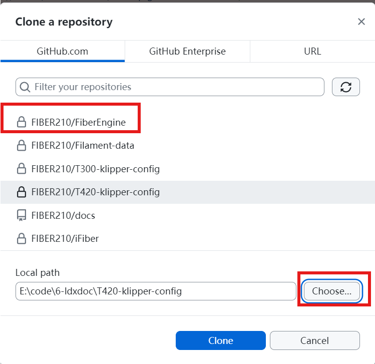
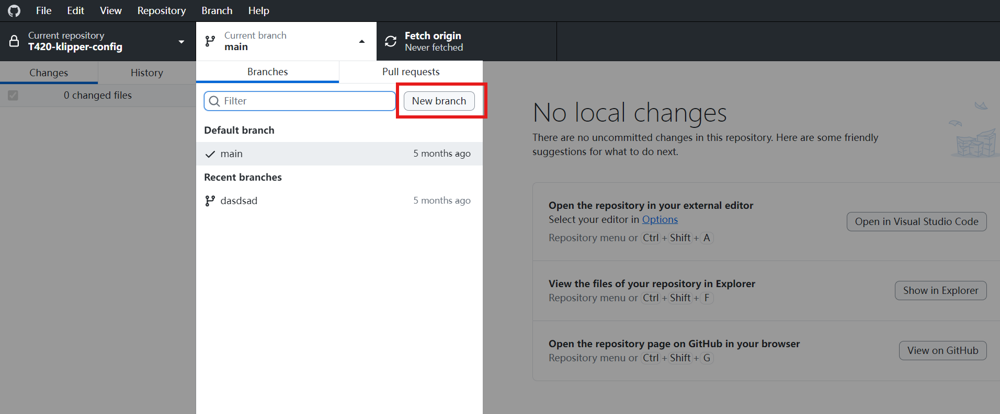
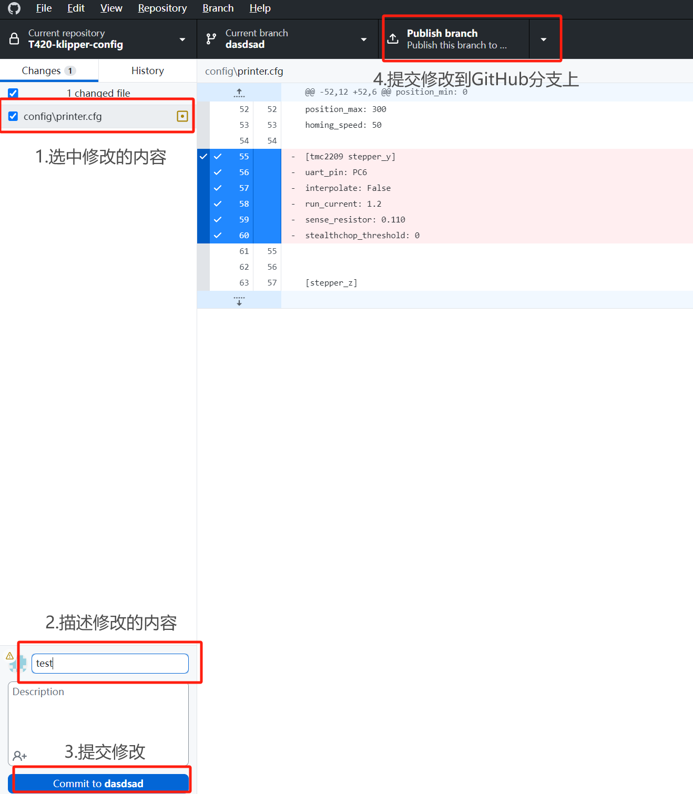

使用指南
========

首先，若需要加入实验室的GitHub组群，请联系孙晨。

如果仅仅需要使用下拉代码看第一部分，如果有协同工作需求看第二部分.

1.下拉代码
-----------

直接从github上下拉代码使用

   图1.1 下载文件

2.协同工作
-----------

注意：在修改代码的时候不要直接改变main分支。

使用desktop实现代码的上传和下拉。

- 首先下载desktop
- 在挂梯子的条件下打开desktop进行如下操作

   图2.1 克隆仓库

   图2.2 选择仓库

   图2.3 新建分支

   图2.4 修改内容

