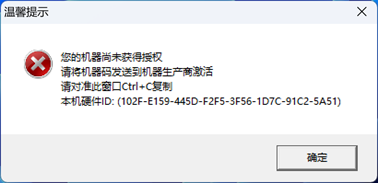
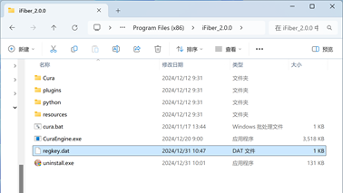
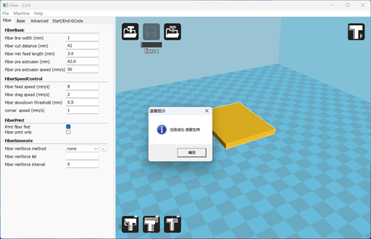
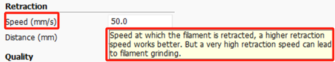
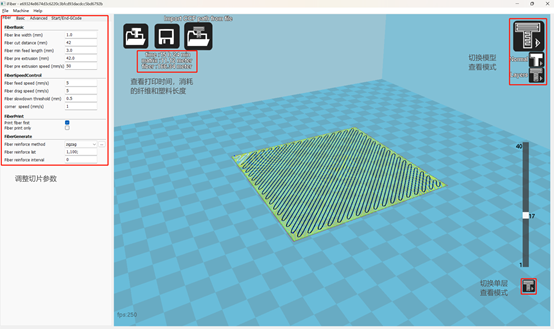
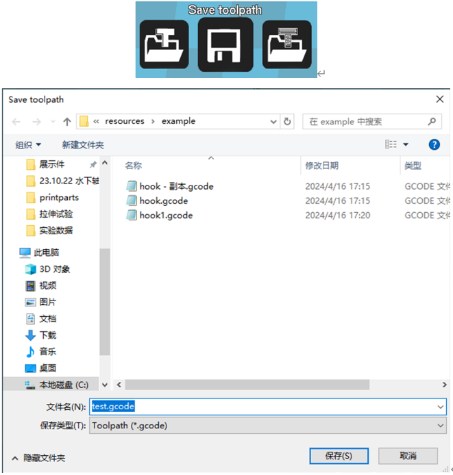

使用说明
=========

若软件已激活直接前往3.2

3.1	软件激活方法
----------------------

未获得机器授权时，切片将会弹出错误窗口，鼠标点选窗口，按照提示复制窗口内信息，提取硬件ID。

   图3.1

与我们联系获取授权文件regkey.dat。许可证文件仅对单台电脑生效。

   图3.2

将授权文件regkey.dat放置到文件的安装目录下。再次运行切片程序。

   图3.3

注册成功后可正常使用。

   图3.4

3.2 stl模型导入和处理
----------------------
打开软件后，点击右侧界面中的 `Load` 按钮导入模型。

3.3 调参切片
---------------
调整左边的切片参数。

在右边查看切片结果，可以看到打印需要用到的时间和消耗塑料及纤维长度。（其中黄色为内部填充塑料，红色为外圈，绿色为内圈，黑色为连续碳纤维，青色为底座支撑等塑料）
可以切换查看模式，有模型和切片模式。
切片模式下可以观看每层的切片路径情况。

3.4 生成Gcode
----------------
检查打印路径没有问题后，即可点击左上角的中间按钮，导出 G 代码准备打印。

