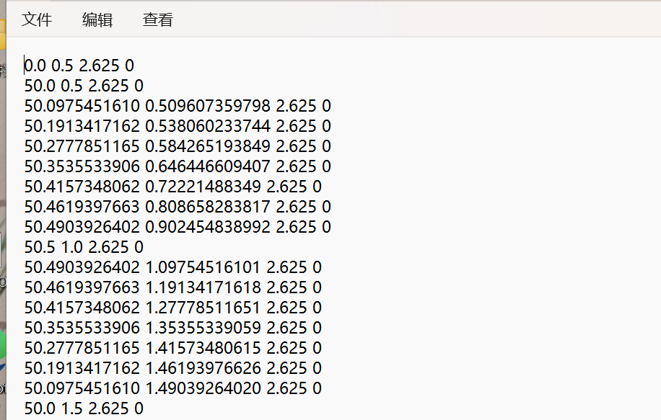

自定义纤维路径添加方式
=========================

在有设计复杂模型纤维增强、特定路径纤维增强等需求的时候，我们往往需要自己绘制纤维路径并添加进模型生成gcode。

通常我们打印纯塑料模型的时候需要用到模型的stl文件，在我们为该模型添加自定义纤维路径增强时，我们需要为其添加一个txt文件，用来代指碳纤维的路径。（在添加时我们需要注意txt文件和stl文件是否位置匹配）

在txt文件中每行有4个值：x y z index

单位是mm,具有相同index的点在同一条多段线上

例如：

0 0 0 1

1 1 0 1

表示在z=0高度上从(0,0)到(1,1)的一条线段

目前我们有3中方式生成所需要用到的txt文件：

- txt手写
- 使用python脚本
- Grassghpper生成

1.txt手写
----------------

这个方法为最基本的方式，其它方法均是采用不同方法来自动生成txt文本。但txt手写的缺点是仅仅使用写一些简单的纤维路径。

   图5.1

2.使用python脚本
-----------------

- 1.获得dxf文件
    在CAD中生成单层纤维路径，选中纤维路径将其合并，如果不能合并先分解（防止打印的纤维不连续），将文件导出为dxf文件。按照需求画出一种或多种的纤维路径待后续处理。

    .. figure:: cad纤维路径示例.png
       :align: center
       :name: cad纤维路径示例

       图5.2

- 2.将dxf文件变成txt文件
    使用GitHub的DXF2TXT仓库 https://github.com/FIBER210/DXF2TXT 的dxfReader.py脚本，具体使用说明查看仓库的readme

3.Grassghpper生成
------------------------

- 1.在犀牛中得到纤维路径

    利用导入dxf文件或者直接在犀牛中绘制，得到需要添加的总纤维路径。（注意路径的第一层高度不为0，为层高h）最后将纤维路径的所有线段进行组合操作，如果不能合并先进行炸开操作。

- 2.将纤维路径添加到Grasshopper的曲线模块中

    .. figure:: 设置曲线.png
       :align: center
       :name: 设置曲线

       图5.3

    获得纤维生成模块为 `GitHub仓库 <https://github.com/FIBER210/docs/tree/main/extra>`_ 上的导出纤维路径.ghuser。

    将该模块导入grasshopper中，把导出纤维路径.ghuser放进下图的文件夹内。

    .. figure:: 导入模块.png
       :align: center
       :name: 导入模块

       图5.4

    使用该模块。

    .. figure:: 使用模块.png
       :align: center
       :name: 使用模块

       图5.5

    将其与纤维生成模块相连。

    .. figure:: 连接模块.png
       :align: center
       :name: 连接模块

       图5.6

- 3. 获得纤维路径的txt文件

    双击模块中的盒子，设定保存的txt路径，点击按钮可以获得纤维路径的txt文件

    .. figure:: 获得txt文件.png
       :align: center
       :name: 获得txt文件

       图5.7

